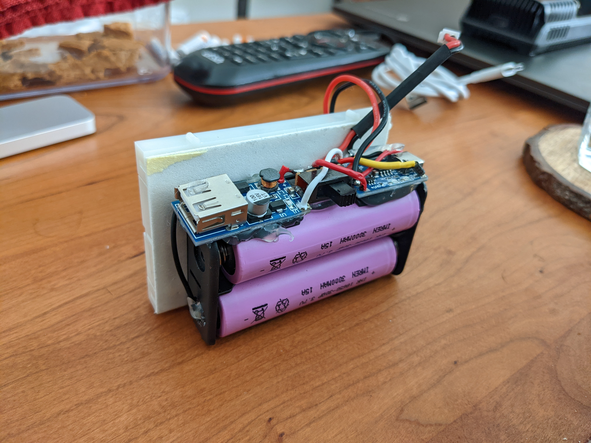
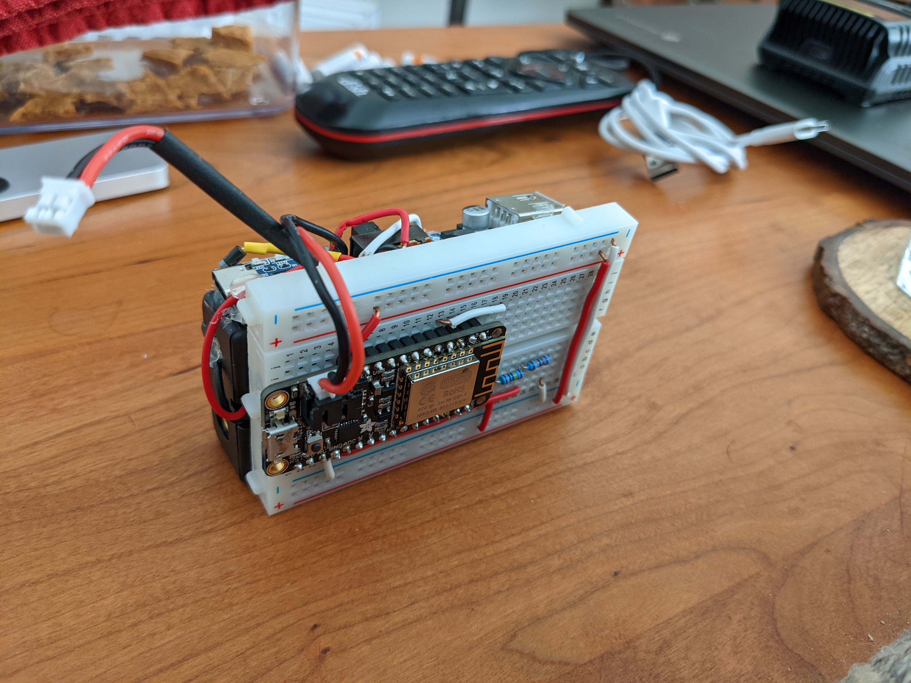
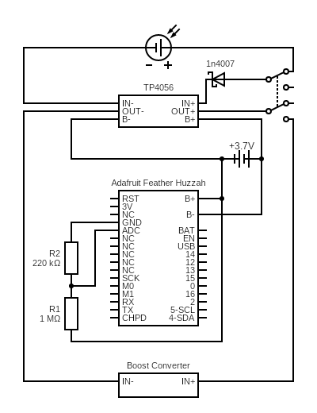

# :battery: Solar Battery Charger
[](./test/v4)
[![task](https://img.shields.io/badge/Task-Enabled-brightgreen?style=for-the-badge&logo=data:image/png;base64,iVBORw0KGgoAAAANSUhEUgAAAEAAAABACAYAAACqaXHeAAAEeElEQVR4Xu2bzU8TQRjGZ7atRQKaGAVRhBakNbYkGEPVE5IoJh403rxIgpgYwOBHPBgPxoTwDyiCelIx8SwqxhilEj9ihBCDhK8g0IIiEAqlgLi1YxZdU2DpzszOfhy2174z7/P+5nlntrtbCHT83BzqQRyAH6sc7v16yYB6JO6aCXX4Q+MFy3InR1Or0jwRrfVoCgAhZKkf7osmKrLK4dZUk2bJ7gT6UTQWw1pgCGCg0uHKxgpWGKQ6gM6Z0IPW0PgpGp1auEFVALeGehFN4SvHqAlCFQB3RwYQH03Y6sRcOABeVTjch4gHygxgCiD4c+5o09jIM9Yi4+fbPfjNVlxczIwuMwCs7I4Lj1VbKAbQOPqVD/O8FVc4yzgIwcPKbDfVBivqoAaAEDpYP9zXwrIg2rmUuIEKgNZ2xwEDOQ5UZuUR10M04PnUD/Q1PI2jR7eYJA6WlWe57uEKwAIwiFBS83DfAu6kRojDbQtZAEa0OwlgORBrAngyFmwL/JzfS5LMqLGpVq60NDOvUUqfJIDL3e3IuT7FqPVQ6ZqN8uDKTu+qeiUB7GxpWrqGv+h0UyUz2qAvs3837ob8fWQAhEEchOC8w2W0mrD0dM1Og/hfY1QAxEynM3PARpsNK7HeQYuxGOifC6+SoQiAOJvR20K0u9QiMAEgTJzEcaAiO0/vhV6WvzsyA36jxLcfmAEQM5/NygXJFl1+B/0vPopioCey2u6qOmDl5Hq1RSK7awpASLbBagPlO3I0aYveSBjwCO8Ga7wg5i0gVe0FpxvIXl8rwES66poDEBIKW9ElxhdRSgoXIWjigHjiuckp4Fj6dgXrDUBgYQ6Eo7yiOXQDICa+4HABCMkaQ3CRcCXH8qO5A2hPCxZ21/wUwF0pT0oqKNmyTTJ8ZGEOTDOyu2EBiMIuOXcB9O+nitAcnYztbngAgsAYQqBky1ZVj01djkHcdhDiDm9OJwlXFKv7Jiil3gRgOsBsAUV9TTLY3ANoboqSEKaJNTdBcxM0N0GazqEaY26C5iZI8WiMymsEg8xTwDwFDHgKCA4+0daKtLhJoUULWCBsqvP6jkt1puydSvFdAYK2JgpVFQCEoMHrS1ijLAChmgl+oejA25d+osowg9UCkD45b7uO8UotFgCxFs+bp0h49s7ywxqADXKDN7yF2M/oiACIhbNsC5YApK705BaLCoAw6f1A/9Wage5auQRy37MAcM7rTPXANKr/G1EDEAsrePcCRX4tytW55vdKAFgg/F7n9Uk/ZMBUpBiA0ragBUBjd6pjEBPkUljz+Oij6q72kyRjSAFsAjCrNt8XJMmRKJaZA+KTOF4/RlbMh6G4ACx2O6hzFTDXy3zCeBA4pwUOAFZ2V70FpBKc+fzB75+aKFrLhokAbLavK6tx7cF+9Z2mLVR1AI4bpABACGP1Xp+FpiDSMZoBEIS9R8H1pf6O+XiRKwGoaXddWkAqaXXnJ7558vvSC4YigAy7veKaq+A26QoqjdfUASvF5rY0oSNpGaDeU6ibjj9v/5xQDsUWRgAAAABJRU5ErkJggg==)](https://taskfile.dev/#/)
[![thingspeak](https://img.shields.io/badge/Thingspeak-Enabled-brightgreen?style=for-the-badge&logo=data:image/png;base64,iVBORw0KGgoAAAANSUhEUgAAAoAAAAKACAMAAAA7EzkRAAACH1BMVEUAAAAAAAAAAAAAAAAAAAAAAAAAAAAAAAAAAAAAAAAAAAAAAAAAAAAAAAAAAAAAAAAAAAAAAAAAAAAAAAAAAAAAAAAAAAAAAAAAAAAAAAAAAAAAAAAAAAAAAAAAAAAAAAAAAAAAAAAAAAAAAAAAAAAAAAAAAAAAAAAAAAAAAAAAAAAAAAAAAAAAAAAAAAAAAAAAAAAAAAAAAAAAAAAAAAAAAAAAAAAAAAAAAAAAAAAAAAAAAAAAAAAAAAAAAAAAAAAAAAAAAAAAAAAAAAAAAAAAAAAAAAAAAAAAAAAAAAAAAAAAAAAAAAAAAAAAAAAAAAAAAAAAAAAAAAAAAAAAAAAAAAAAAAAAAAAAAAAAAAAAAAAAAAAAAAAAAAAAAAAAAAAAAAAAAAAAAAAAAAAAAAAAAAAAAAAAAAAAAAAAAAAAAAAAAAAAAAAAAAAAAAAAAAAAAAAAAAAAAAAAAAAAAAAAAAAAAAAAAAAAAAAAAAAAAAAAAAAAAAAAAAAAAAAAAAAAAAAAAAAAAAAAAAAAAAAAAAAAAAAAAAAAAAAAAAAAAAAAAAAAAAAAAAAAAAAAAAAAAAAAAAAAAAAAAAAAAAAAAAAAAAAAAAAAAAAAAAAAAAAAAAAAAAAAAAAAAAAAAAAAAAAAAAAAAAAAAAAAAAAAAAAAAAAAAAAAAAAAAAAAAAAAAAAAAAAAAAAAAAAAAAAAAAAAAAAAAAAAAAD///+Ye8rmAAAAs3RSTlMAAQMEBgcICwwNDg8REhMUGRobHB0fICEiIyQlJicsLS4vMzQ3ODk6OzxAQURFRkdISUpLTE1OT1BRUlNUVVZXWFlaW1xdXl9gYWJjZGVmZ2hpamtsbW5vcHFyc3R1dnd4enx+gIGDhYiJi4yOkJGSk5SVlpqfoKGio6Slpqeorq+ws7S1t7u+v8DBw8rLzM3O0dLT1dbX2Nna3d/g4eLn6Onq6+3u7/Dx9PX29/n6+/z9/vUVDfIAAAABYktHRLRECWrdAAAH9UlEQVR42u3d+Z9NdRjAccNM02gMpo1RlshSSItKqLQQxiQtWk2LSotW0W4pGgrTIkqlISUywj+YlIzMcO/ce85z5p73+094ns8v9/U99/vt1w8AAAAAAAAAAAAAAAAAgGINmwxJq+85wOXHIWnXCBABIkABIkAEKEAEiAAFiAARIAgQAYIAESAIEAGCABEgCBABggARIAgQAYIAESAIEAGCABEgCBABggARIAIUIAJEgAJEgAhQgAgQAZoOAkSAIEAECAJEgCBABAgCRIAgQAQIAkSAIEAECAJEgCBABAgCRIAgQAQIAkSACFCACBABChABIkABIkAECAJEgCBABAgCRIAgQAQIAkSAIEAECAJEgCBABAgCRIAgQAQIAkSAIEAEiAAFiAARoAARIAIUIAJEgAJEgAgQBIgAQYAIEASIAEGACBAEiABBgAgQBIgAQYAIEASIAEGACBAEiABBgAgQAQoQASJAASJABChABIgAQYAIEASIAEGACBAEiABBgAgQBIgAQYAIEASIAEGACBAEiABBgAgQBIgAQYAIEAEKEAEiQAEiQAQoQASIAEGACBAEiABBgAgQBIgAQYAIEASIAEGACBAEiABBgAgQBIgAQYAIEASIABGgABEgAhQgAkSAAkSACFCACBABggARIAgQAYIAESAIEAGCABEgCBABggARIAgQAYIAESAIEAGCABEgCBABIkABIkAEKEAEiAAFiAARIAgQAYIAESAIEAGCABEgCBABggARIAgQAYIAESAIEAGCABEgCBABggARIAIUIAJEgAJEgAhQgAgQAQoQASJAECACBAEiQBAgAgQBIkAQIAIEASJAECACBAEiQBAgAgQBIkAQIAIEASJABChABIgABYgAEaAAESACNB0EiABBgAgQBIgAQYAIEASIAEGACBAEiABBgAgQBIgAQYAIEASIAEGACBAEiAARoAARIAIUIAJEgAJEgAgQBIgAQYAIEASIAEGACBAEiABBgAgQBIgAQYAIEASIAEGACBAEiABBgAgQAQoQASJAASJABChABIgABYgAESAIEAGCABEgCBABggARIAgQAYIAESAIEAGCABEgCBABggARIAgQAYIAESACFCACRIACRIAIUIAIEAGCABEgCBABggARIAgQAYIAESAIEAGCABEgCBABggARIAgQAYIAESAIEAGCABEgAhQgAkSAAkSACFCACBABggARIAgQAYIAESAIEAGCABEgCBABggARIAgQAYIAESAIEAGCABEgCBABIkABkskA526iq1/6+q4P7P/b3u9P+nLbebWlMdUx/SjQsK/7TGpHv/p45bK50ydffdXwS+vr62stryLUresj/e25wrIqUlXr0T4R4CarqlSzf+8LAX5iURVr9O4+EOBae6pcgz/LfoAfWVMFq16V+QDX2FJFa+nMeICr7KiyTd2f7QDfsqIK17Qj0wG+bkOVbuCGLAe40oIqXv8VGQ7wVfvJgebDmQ3wFdvJg4kdWQ3wZcvJhUvaMxrgS3aTD3UZ/Smywmr8FIn0os3kxqIsnoq8YC/5MeW37AX4vLXkyMjsfaC13FbyZPDnWQvwOUvJlZoPMhbgs3aSL1XLj2UqwGesJG/mZepc7mkLyZ2JezMUYKt95M/wbwVIpEHZ+bfSMtvIo+p3BEiopRm5OOEpq8ipmQcFSKRxewRIpMbtGQjwSXvIrwvXxwf4hDXkWAY+UhVgvi2M/kj1cTvIt0n7BEikpthzucdsIO8GtQmQSAPeDgzwUfMn8lxOgJwwI+xcbqnhc8KYnwRIpKHbYgJ8xOg5qXa9AIlUFfLk6MMGzynNnQIk0uRfUw/wIVPntBG7BEikhs0pB/igmdNVzRoBEirdc7klBs7/zDokQCKN+zm9AB8wbs5ycbsAiTRwowCJ1P+1lAJcbNZ0q+WIAIl0XSqPOtxv0PRg1A8CJNKQL5IPsMWY6dEFHwqQSMl/pLrIkDmX+YcFSKSEH3VoNmHOrWmnAImU6OUxC82X86leLUBCJfeR6gLDpQCJPeogQAqS1KMO842WgjS2C5BIyXykKkAKlcijDveZKwVbckSARJpS9stj5hkqRSj75TECpCgNbQIkUpnP5QRIscp6LidAinZbGc/l5honRSvjow4CpBeGbhUgkWrXCpBI5fq/nADppTl/CJBIEzoESKRhO0oP8F5jpNfqPhUgkQa8IUBClXqPpQApTYn3WAqQEo3cLUAiDd5SQoD3mB+lqnlXgESqaj0qQCLNOihAIvX26g4BUh6N2wVIpLoNAiRSr67uuNvcKJvmTgESqfirOwRIOY34ToBEatgiQCLVvFdUgHeZGOVV1XpMgES6/ZAAiTS+Q4BEuvwbARKp4P/LCZBEDHizsADnGBXJWPqnAIk07YAAiTT6RwESachWARKpdp0AiXTeeyzvNCMStaBTgESatE+ARGraKUAiDWoTIJGq1wiQUD2+LydAUtHT5TF3GA2p6OHymNkmQzoa27sLcJbBkJKBG7sJcKa5kJbuLo+ZYSykp+Wsc7lbDYUUnXV5zC1mQppG7DozwJuNhFQ1bD4jwJtMhHRVr+4a4I0GQtq6nsvdYBykbubpc7nrTYP0jf3vXG6aYRDgslOPrU81CyLU//uR6hSjIObH8PsnA7zWJIjxzz82JxgEURafuL5orDEQZvrB46NMgTjjO640BAI1XmQGAAAAAAAAAAAAAOTTX4AfYWcXMeCxAAAAAElFTkSuQmCC)](https://thingspeak.com/channels/1642208)

A solar battery charger to charge lithium ion (li-ion) 18650, 9V, and coin batteries and Ni-MH AA and AAA batteries.






## TL;DR;

Update parameters in `secrets.h` and header of `solar-battery-charger.ino`.

```shell
brew install arduino-cli
arduino-cli config init
arduino-cli config add board_manager.additional_urls http://arduino.esp8266.com/stable/package_esp8266com_index.json
arduino-cli core update-index
arduino-cli core install esp8266:esp8266
arduino-cli compile -b esp8266:esp8266:huzzah .
arduino-cli upload -b esp8266:esp8266:huzzah . -p /dev/ttyUSB0 .
screen /dev/ttyUSB0 115200
```

## :goal_net:&nbsp; Objectives
- Recharge li-ion 18650, 9V, and coin batteries via a solar panel.
- Recharge Ni-MH AA and AAA batteries indirectly via a solar panel.
- Make the li-ion battery pack portable to easily recharge other devices. 
- Receive notificatinos when the li-ion batteries are fully charged.
- Monitor the rate of charging via an online IOT service such as [ThingSpeak](https://thingspeak.com/) or [Adafruit IO](https://io.adafruit.com/). 
- Learn about solar cells, panels, li-ion, and [Ni-MH batteries](https://en.wikipedia.org/wiki/Nickel%E2%80%93metal_hydride_battery).

## :framed_picture:&nbsp; Background

I recently replaced my solar landscape lights with hardwired ones and so I had a bunch of solar cells that I didn't
know what to do with. I decided to salvage the solar cells to build myself a solar battery charger since I try to
use as many rechargable batteries as possible as well as learn about solar panels and rechargable batteries. The
problem with recharging Ni-MH batteries is that they're difficult to monitor and prevent overcharging. Therefore,
I decided to create a lithium ion solar charger that then can be used to charge Ni-MH batteries via existing USB
chargers.


## :bulb:&nbsp; Concept

The concept is to create a solar panel and circuit to charge 18650 li-ion batteries and then use the charged li-ion
batteries to charge Ni-MH batteries via existing USB chargers. The li-ion batteries are to be disconnectable from
the solar panel to make more portable to recharge other devices and batteries.

Monitoring is handled by an Adafruit Feather Huzzah (Feather) that has built in wifi support which makes it easy to
monitor remotely as well as collect data. The board will monitor when the li-ion battery is charging and when
charging is complete. It can also send notifications when the charge is complete via IFTTT.

## Current Limitations

- As of the time of this writing, charging the li-ion batteries and using the USB port need to happen separately.
  Therefore, charging the li-ion batteries and charging other things with the USB port can't happen at the same time.
- The Feather is being powered by the charging li-ion batteries and so the Feather won't turn on unless there is enough
  juice in the batteries.
- The Feather is draining the charging li-ion batteries as they are charging.
- The voltage divider used to measure the battery voltage is constantly draining the battery.

## :desktop_computer:&nbsp; Hardware
- 15X [Energizer LED Solar pathway Lights](https://outdoorsolaroutlet.com/products/new-led-energizer-10pack-solar-pathway-lights-outdoor-stainless-steel-bronze)
- 1X [Adafruit Feather Huzzah ESP8266](https://learn.adafruit.com/adafruit-feather-huzzah-esp8266/)
- 2X [IMREN 3.7v 18650 Rechargeable Battery 3000mAh](https://www.amazon.com/gp/product/B09L5M1WN6/)
- 1X [NITECORE UMS2 Charger](https://www.amazon.com/gp/product/B07JN49XYM/)
- 1X [HiLetgo TP4056 Type-C USB 5V 1A 18650 Lithium Battery Charger Module](https://www.amazon.com/gp/product/B07PKND8KG/)
- 1X [DC-DC 0.9V-5V to USB 5V Boost Step-up Power Supply Module Booster Circuit Board](https://www.amazon.com/gp/product/B07QKYHFJB/)
- 1X [18650 2 Battery Holder 7.4V](https://www.amazon.com/gp/product/B08B86KHB2/)
- 1X [1N4007 Schottky Diode](https://www.amazon.com/gp/product/B07Q5FZR7X/)
- 1X [EBL 9V Li-ion Battery Charger](https://www.amazon.com/gp/product/B00HV4KFSA/)
- 1X [CT-Energy Lithium Coin Button Batteries Charger](https://www.amazon.com/gp/product/B088ZB9YZT/)
- 1X [Lithium Ion Polymer Battery - 3.7v 500mAh](https://www.adafruit.com/product/1578)
- 1X [220kΩ Resistor](https://www.amazon.com/gp/product/B072BL2VX1/)
- 1X [1MΩ Resistor](https://www.amazon.com/gp/product/B072BL2VX1/)
- 1X [JST-PH 2.0 Male and Female Connector Cable](https://www.amazon.com/gp/product/B07NWD5NTN)
- 1X [DPDT 2 Position 6 Terminals Panel Mount Horizontal Slide Switch](https://www.amazon.com/gp/product/B01N6ROMW3)

## :robot:&nbsp; Services
- [IFTTT](https://ifttt.com/)
- [ThingSpeak](https://thingspeak.com/)

## :floppy_disk:&nbsp; Software
- [arduino-cli](https://arduino.github.io/arduino-cli/latest/installation)
- [ubuntu server](https://ubuntu.com/download/server)
- [go-task](https://github.com/go-task/task)
- [GNU Screen](https://www.gnu.org/software/screen/)
- [jq](https://stedolan.github.io/jq) (for go-task)

## :electric_plug:&nbsp; Circuit



Circuit made with [Circuit Diagram](https://www.circuit-diagram.org/)

## :gear:&nbsp; Configuration

Because I work mainly out of a Chromebook and Rasperry Pis, this project is using the `arduino-cli` command line utility
[with Linux](https://support.google.com/chromebook/answer/9145439?hl=en) rather than the
[Arduino IDE](https://www.arduino.cc/en/software).

Initialize the config

```shell
arduino-cli config init
```

Add the [esp8266 package library](https://github.com/esp8266/Arduino)

```shell
arduino-cli config add board_manager.additional_urls http://arduino.esp8266.com/stable/package_esp8266com_index.json
```

Check that the update addition was successful.

Note: this is assuming that `arduino-cli` was installed in the home directory (`~/.arduino15`)

```
cat ~/.arduino15/arduino-cli.yaml
```

```yaml
# ~/.arduino15/arduino-cli.yaml
board_manager:
  additional_urls:
    - https://arduino.esp8266.com/stable/package_esp8266com_index.json
...
```

Update the core index

```shell
arduino-cli core update-index
```

Install the `esp8266` core

```shell
arduino-cli core install esp8266:esp8266
```

Search for the huzzah board

```shell
arduino-cli board search huzzah
```

Typical Output

```shell
Board Name                      FQBN                   Platform ID
Adafruit Feather HUZZAH ESP8266 esp8266:esp8266:huzzah esp8266:esp8266
```

Take note of the output under `FQBN` because that is what will need to be passed as the `board` (`-b`) parameter with the `arduino-cli` command.
In this example, the board to be used will be `esp8266:esp8266:huzzah`.

Install the [ThingSpeak library](https://www.arduinolibraries.info/libraries/thing-speak)

```shell
arduino-cli lib install ThingSpeak
```

Update the variables in [`secret.h`](#key-secrets) and the header of `solar-battery-charger.ino`.

Compile the sketch

From the directory of the sketch:

Note: The dot at the end of the command tells `arduino-cli` to use the sketch in the current directory. The name of the sketch may also be used.

```shell
arduino-cli compile -b esp8266:esp8266:huzzah .
```

Typical Output

```shell
Executable segment sizes:
ICACHE : 32768           - flash instruction cache
IROM   : 236116          - code in flash         (default or ICACHE_FLASH_ATTR)
IRAM   : 27273   / 32768 - code in IRAM          (IRAM_ATTR, ISRs...)
DATA   : 1496  )         - initialized variables (global, static) in RAM/HEAP
RODATA : 908   ) / 81920 - constants             (global, static) in RAM/HEAP
BSS    : 25680 )         - zeroed variables      (global, static) in RAM/HEAP
Sketch uses 265793 bytes (25%) of program storage space. Maximum is 1044464 bytes.
Global variables use 28084 bytes (34%) of dynamic memory, leaving 53836 bytes for local variables. Maximum is 81920 bytes.
```

Be sure to compile your code before uploading it if changes have been made to the sketch!

Upload the sketch to the Feather

```shell
arduino-cli upload -p /dev/ttyUSB0 -b esp8266:esp8266:huzzah .
```

Typical Output

```shell
esptool.py v3.0
Serial port /dev/ttyUSB0
Connecting........_____.
Chip is ESP8266EX
Features: WiFi
Crystal is 26MHz
MAC: bc:dd:c2:2d:ce:0d
Uploading stub...
Running stub...
Stub running...
Configuring flash size...
Auto-detected Flash size: 4MB
Compressed 269952 bytes to 198163...
Wrote 269952 bytes (198163 compressed) at 0x00000000 in 17.5 seconds (effective 123.5 kbit/s)...
Hash of data verified.

Leaving...
Hard resetting via RTS pin...
```

Monitor serial connection using GNU Screen

Make sure your baud rate matches the baud rate inside of your sketches!

```shell
screen /dev/ttyUSB0 115200
```

Typical Output

```shell
Connecting to SSID: MySSID
.connected
IP Address: 192.168.1.77
Hostname: Feather
Battery level: 644
Battery percentage: 55%
Battery voltage: 3.49V
Channel number: 1642208
Channel update successful
Going to sleep for 15 minutes
...
```

Kill the monitoring screen by pressing <kbd>Ctrl</kbd> + <kbd>a</kbd> <kbd>k</kbd> <kbd>y</kbd>

### :key:&nbsp; Secrets

`secrets.h` is a file used to store secrets such as API tokens and wifi
credentials that aren't updated in GitHub. The file is ignored in `.gitignore`.

Secrets can be used in sketches using the following code:

```C++
#include "secrets.h"
```

The nomenclature used in this project is different than what [arduino-cli](https://arduino.github.io/arduino-cli/0.20/sketch-specification/#secrets)
specifies (`arduino_secrets.h`) because this project does not use an Arduino.

### Metadata

Instead of specifying `-b` and `-p` for every command, a [sketch.json](https://arduino.github.io/arduino-cli/0.20/sketch-specification/#metadata) may be stored in the sketch directory
that sets the defaults for that sketch.

The `sketch.json` file may be generated by using the [arduino-cli board attach](https://arduino.github.io/arduino-cli/0.20/commands/arduino-cli_board_attach/) command.

```shell
arduino-cli board attach -b esp8266:esp8266:huzzah .
arduino-cli board attach -p /dev/ttyUSB0 .
```

Attaching the board didn't work for me because `arduino-cli` didn't recognize
the Feather attached to my port for some reason and so I had to manually add
the port.

Note: The port needs to start with the protocol, e.g. `serial://`.

The documentation doesn't show what a typical sketch.json looks like so here is one:

`sketch.json`
```json
{
  "cpu": {
    "fqbn": "esp8266:esp8266:huzzah",
    "port": "serial:///dev/ttyUSB0"
  }
}
```

## Task

[go-task](https://github.com/go-task/task) may be used to automate some of the commands.

Update the parameters in `task.env`.

> Note: Variables are duplicated both in `task.env` and `sketch.json` because I couldn't get
  go-task to not have errors when trying to parse `sketch.json` when it didn't exist.

Bootstrap the entire environment (not including the installation of `arduino-cli`).

> :warning: WARNING! this will overwrite your entire `arduino-cli` config file!

```shell
task bootstrap
```

Compile, upload, and monitor the sketch.

```shell
task compile-upload
```

Get a list of all of the commands.

```shell
task
```

## :test_tube:&nbsp; Tests
- [ ] [adjusttime](./test/adjusttime)
- [X] [battery](./test/battery)
- [X] [blink](./test/blink)
- [X] [cell](./test/cell)
- [X] [comparedates](./test/comparedates)
- [X] [createdat](./test/createdat)
- [X] [date](./test/date)
- [X] [eeprom](./test/eeprom)
- [X] [panel](./test/panel)
- [X] [sleep](./test/sleep)
- [X] [sunset](./test/sunset)
- [X] [thingspeak](./test/thingspeak)
- [X] [v2](./test/v2)
- [X] [v3](./test/v3)
- [X] [v4](./test/v4)
- [X] [wifi](./test/wifi)

## :clipboard:&nbsp; Todo

### Design
- [ ] Wooden solar panel box designed as panel frame.

### Tests
- [ ] Notifications for Amazon Alexa and mobile phone.
- [ ] Determine the optimal number of 18650 li-ion batteries to charge.
- [ ] Optimize solar panel.

### Tools
- [X] Implement `go-task`.
- [ ] Implement `pre-commit`.
- [X] Create test template.

### Documentation
- [ ] Write troubleshooting section.
- [ ] Create schematics.
- [X] Add images.
- [ ] Write `test` READMEs.

## :hammer_and_wrench:&nbsp; Troubleshooting

### Error during build: platform not installed

```shell
Error during build: platform not installed
```

Fix

```shell
arduino-cli core install esp8266:esp8266
```

### The internal LED is dim and the console is blank when connected to a computer via USB

The Feather needs to be reset. Press the physical `RESET` button.

### Count not open port [Errno 16] Device or resource busy

```shell
serial.serialutil.SerialException: [Errno 16] could not open port /dev/ttyUSB0: [Errno 16] Device or resource busy: '/dev/ttyUSB0'
Error during Upload: Failed uploading: uploading error: exit status 1
```

Fix: The serial port is open and reading the output of the Feather. Close the connection

## :link:&nbsp; References
- https://www.seeedstudio.com/blog/2019/10/09/voltage-dividers-everything-you-need-to-know/
- https://cdn-learn.adafruit.com/downloads/pdf/adafruit-feather-huzzah-esp8266.pdf
- http://web.mit.edu/evt/summary_battery_specifications.pdf
- https://dronebotworkshop.com/dc-volt-current/#Voltage_References
- https://learn.adafruit.com/using-ifttt-with-adafruit-io/arduino-code-2
- https://learn.adafruit.com/using-ifttt-with-adafruit-io/wiring#battery-tracking
- https://siytek.com/arduino-cli-raspberry-pi/
- https://www.best-microcontroller-projects.com/tp4056-page2.html
- https://en.wikipedia.org/wiki/Nickel%E2%80%93metal_hydride_battery
- https://arduino.github.io/arduino-cli/
- https://www.electronicshub.org/solar-battery-charger-for-18650/
- https://create.arduino.cc/projecthub/B45i/getting-started-with-arduino-cli-7652a5
- https://github.com/webdevops/go-replace
- https://arduino-esp8266.readthedocs.io/en/latest/index.html
- https://roboticsbackend.com/arduino-store-array-into-eeprom/
- https://www.arduino.cc/en/Tutorial/BuiltInExamples/Debounce
- https://www.arduino.cc/en/Tutorial/BuiltInExamples/StateChangeDetection
- https://github.com/esp8266/Arduino/tree/master/libraries/EEPROM
- https://support.microsoft.com/en-us/office/slope-function-11fb8f97-3117-4813-98aa-61d7e01276b9
- https://github.com/arduino-libraries/NTPClient/blob/master/examples/Basic/Basic.ino
- https://www.mathworks.com/help/thingspeak/use-ifttt-to-send-text-message-notification.html?searchHighlight=ifttt&s_tid=srchtitle_ifttt_1
- https://www.mathworks.com/help/thingspeak/read-data-for-regression-analysis.html

## :balance_scale:&nbsp; License

[Apache 2.0 License](./LICENSE)

## :pencil:&nbsp; Author
This project was started in 2022 by [Nicholas Wilde](https://github.com/nicholaswilde/).
