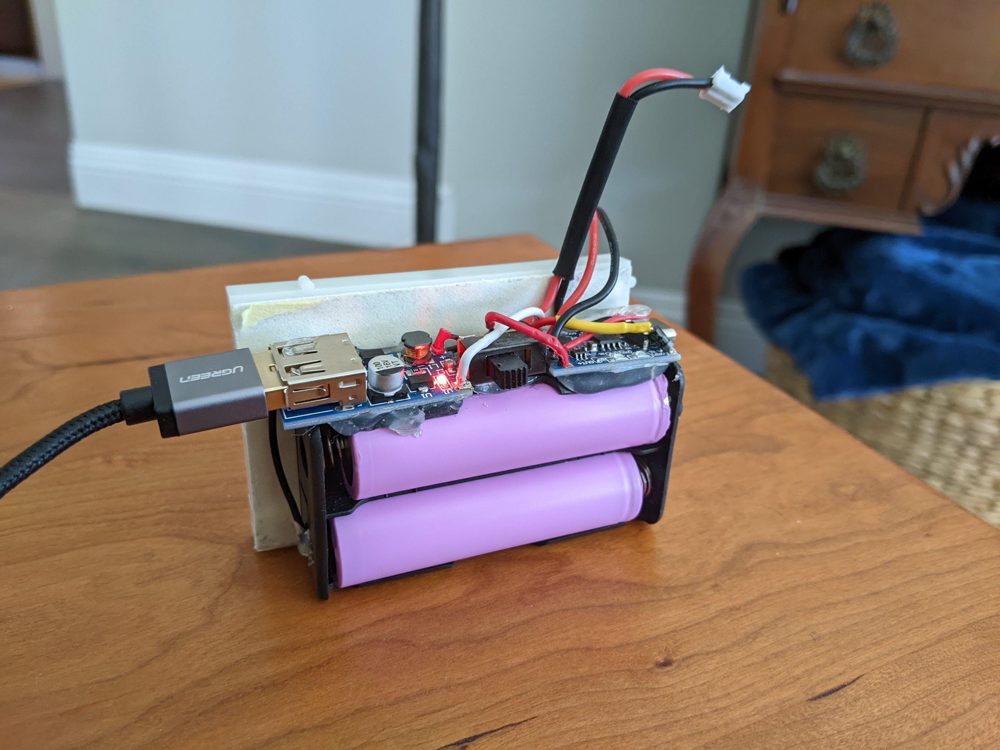
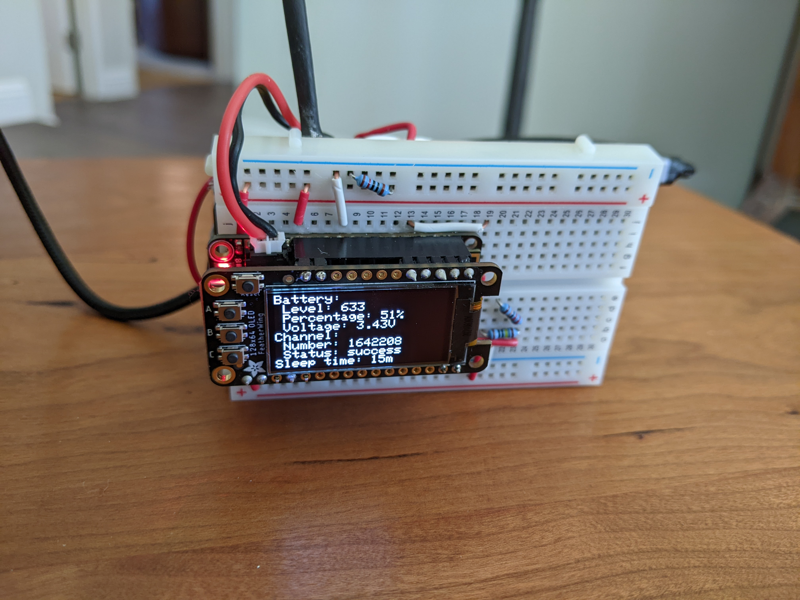
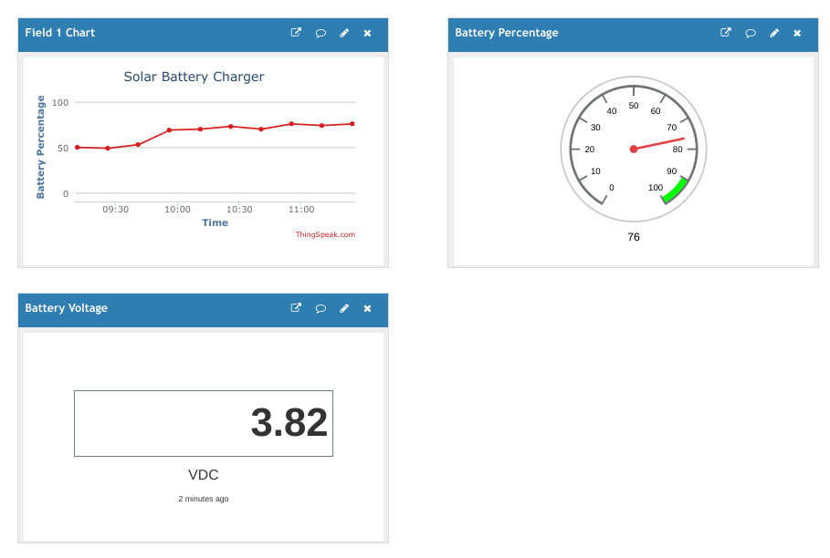

# :battery: Solar Battery Charger :sunny:
[](./test/v4)
[](https://github.com/nicholaswilde/solar-battery-charger/actions/workflows/ci.yaml)
[![task](https://img.shields.io/badge/Task-Enabled-brightgreen?style=for-the-badge&logo=data:image/png;base64,iVBORw0KGgoAAAANSUhEUgAAAEAAAABACAYAAACqaXHeAAAEeElEQVR4Xu2bzU8TQRjGZ7atRQKaGAVRhBakNbYkGEPVE5IoJh403rxIgpgYwOBHPBgPxoTwDyiCelIx8SwqxhilEj9ihBCDhK8g0IIiEAqlgLi1YxZdU2DpzszOfhy2174z7/P+5nlntrtbCHT83BzqQRyAH6sc7v16yYB6JO6aCXX4Q+MFy3InR1Or0jwRrfVoCgAhZKkf7osmKrLK4dZUk2bJ7gT6UTQWw1pgCGCg0uHKxgpWGKQ6gM6Z0IPW0PgpGp1auEFVALeGehFN4SvHqAlCFQB3RwYQH03Y6sRcOABeVTjch4gHygxgCiD4c+5o09jIM9Yi4+fbPfjNVlxczIwuMwCs7I4Lj1VbKAbQOPqVD/O8FVc4yzgIwcPKbDfVBivqoAaAEDpYP9zXwrIg2rmUuIEKgNZ2xwEDOQ5UZuUR10M04PnUD/Q1PI2jR7eYJA6WlWe57uEKwAIwiFBS83DfAu6kRojDbQtZAEa0OwlgORBrAngyFmwL/JzfS5LMqLGpVq60NDOvUUqfJIDL3e3IuT7FqPVQ6ZqN8uDKTu+qeiUB7GxpWrqGv+h0UyUz2qAvs3837ob8fWQAhEEchOC8w2W0mrD0dM1Og/hfY1QAxEynM3PARpsNK7HeQYuxGOifC6+SoQiAOJvR20K0u9QiMAEgTJzEcaAiO0/vhV6WvzsyA36jxLcfmAEQM5/NygXJFl1+B/0vPopioCey2u6qOmDl5Hq1RSK7awpASLbBagPlO3I0aYveSBjwCO8Ga7wg5i0gVe0FpxvIXl8rwES66poDEBIKW9ElxhdRSgoXIWjigHjiuckp4Fj6dgXrDUBgYQ6Eo7yiOXQDICa+4HABCMkaQ3CRcCXH8qO5A2hPCxZ21/wUwF0pT0oqKNmyTTJ8ZGEOTDOyu2EBiMIuOXcB9O+nitAcnYztbngAgsAYQqBky1ZVj01djkHcdhDiDm9OJwlXFKv7Jiil3gRgOsBsAUV9TTLY3ANoboqSEKaJNTdBcxM0N0GazqEaY26C5iZI8WiMymsEg8xTwDwFDHgKCA4+0daKtLhJoUULWCBsqvP6jkt1puydSvFdAYK2JgpVFQCEoMHrS1ijLAChmgl+oejA25d+osowg9UCkD45b7uO8UotFgCxFs+bp0h49s7ywxqADXKDN7yF2M/oiACIhbNsC5YApK705BaLCoAw6f1A/9Wage5auQRy37MAcM7rTPXANKr/G1EDEAsrePcCRX4tytW55vdKAFgg/F7n9Uk/ZMBUpBiA0ragBUBjd6pjEBPkUljz+Oij6q72kyRjSAFsAjCrNt8XJMmRKJaZA+KTOF4/RlbMh6G4ACx2O6hzFTDXy3zCeBA4pwUOAFZ2V70FpBKc+fzB75+aKFrLhokAbLavK6tx7cF+9Z2mLVR1AI4bpABACGP1Xp+FpiDSMZoBEIS9R8H1pf6O+XiRKwGoaXddWkAqaXXnJ7558vvSC4YigAy7veKaq+A26QoqjdfUASvF5rY0oSNpGaDeU6ibjj9v/5xQDsUWRgAAAABJRU5ErkJggg==)](https://taskfile.dev/#/)
[![thingspeak](https://img.shields.io/badge/Thingspeak-Enabled-brightgreen?style=for-the-badge&logo=data:image/png;base64,iVBORw0KGgoAAAANSUhEUgAAAoAAAAKACAMAAAA7EzkRAAACH1BMVEUAAAAAAAAAAAAAAAAAAAAAAAAAAAAAAAAAAAAAAAAAAAAAAAAAAAAAAAAAAAAAAAAAAAAAAAAAAAAAAAAAAAAAAAAAAAAAAAAAAAAAAAAAAAAAAAAAAAAAAAAAAAAAAAAAAAAAAAAAAAAAAAAAAAAAAAAAAAAAAAAAAAAAAAAAAAAAAAAAAAAAAAAAAAAAAAAAAAAAAAAAAAAAAAAAAAAAAAAAAAAAAAAAAAAAAAAAAAAAAAAAAAAAAAAAAAAAAAAAAAAAAAAAAAAAAAAAAAAAAAAAAAAAAAAAAAAAAAAAAAAAAAAAAAAAAAAAAAAAAAAAAAAAAAAAAAAAAAAAAAAAAAAAAAAAAAAAAAAAAAAAAAAAAAAAAAAAAAAAAAAAAAAAAAAAAAAAAAAAAAAAAAAAAAAAAAAAAAAAAAAAAAAAAAAAAAAAAAAAAAAAAAAAAAAAAAAAAAAAAAAAAAAAAAAAAAAAAAAAAAAAAAAAAAAAAAAAAAAAAAAAAAAAAAAAAAAAAAAAAAAAAAAAAAAAAAAAAAAAAAAAAAAAAAAAAAAAAAAAAAAAAAAAAAAAAAAAAAAAAAAAAAAAAAAAAAAAAAAAAAAAAAAAAAAAAAAAAAAAAAAAAAAAAAAAAAAAAAAAAAAAAAAAAAAAAAAAAAAAAAAAAAAAAAAAAAAAAAAAAAAAAAAAAAAAAAAAAAAAAAAAAAAAAAAAAAAAAAAAAAD///+Ye8rmAAAAs3RSTlMAAQMEBgcICwwNDg8REhMUGRobHB0fICEiIyQlJicsLS4vMzQ3ODk6OzxAQURFRkdISUpLTE1OT1BRUlNUVVZXWFlaW1xdXl9gYWJjZGVmZ2hpamtsbW5vcHFyc3R1dnd4enx+gIGDhYiJi4yOkJGSk5SVlpqfoKGio6Slpqeorq+ws7S1t7u+v8DBw8rLzM3O0dLT1dbX2Nna3d/g4eLn6Onq6+3u7/Dx9PX29/n6+/z9/vUVDfIAAAABYktHRLRECWrdAAAH9UlEQVR42u3d+Z9NdRjAccNM02gMpo1RlshSSItKqLQQxiQtWk2LSotW0W4pGgrTIkqlISUywj+YlIzMcO/ce85z5p73+094ns8v9/U99/vt1w8AAAAAAAAAAAAAAAAAgGINmwxJq+85wOXHIWnXCBABIkABIkAEKEAEiAAFiAARIAgQAYIAESAIEAGCABEgCBABggARIAgQAYIAESAIEAGCABEgCBABggARIAIUIAJEgAJEgAhQgAgQAZoOAkSAIEAECAJEgCBABAgCRIAgQAQIAkSAIEAECAJEgCBABAgCRIAgQAQIAkSACFCACBABChABIkABIkAECAJEgCBABAgCRIAgQAQIAkSAIEAECAJEgCBABAgCRIAgQAQIAkSAIEAEiAAFiAARoAARIAIUIAJEgAJEgAgQBIgAQYAIEASIAEGACBAEiABBgAgQBIgAQYAIEASIAEGACBAEiABBgAgQAQoQASJAASJABChABIgAQYAIEASIAEGACBAEiABBgAgQBIgAQYAIEASIAEGACBAEiABBgAgQBIgAQYAIEAEKEAEiQAEiQAQoQASIAEGACBAEiABBgAgQBIgAQYAIEASIAEGACBAEiABBgAgQBIgAQYAIEASIABGgABEgAhQgAkSAAkSACFCACBABggARIAgQAYIAESAIEAGCABEgCBABggARIAgQAYIAESAIEAGCABEgCBABIkABIkAEKEAEiAAFiAARIAgQAYIAESAIEAGCABEgCBABggARIAgQAYIAESAIEAGCABEgCBABggARIAIUIAJEgAJEgAhQgAgQAQoQASJAECACBAEiQBAgAgQBIkAQIAIEASJAECACBAEiQBAgAgQBIkAQIAIEASJABChABIgABYgAEaAAESACNB0EiABBgAgQBIgAQYAIEASIAEGACBAEiABBgAgQBIgAQYAIEASIAEGACBAEiAARoAARIAIUIAJEgAJEgAgQBIgAQYAIEASIAEGACBAEiABBgAgQBIgAQYAIEASIAEGACBAEiABBgAgQAQoQASJAASJABChABIgABYgAESAIEAGCABEgCBABggARIAgQAYIAESAIEAGCABEgCBABggARIAgQAYIAESACFCACRIACRIAIUIAIEAGCABEgCBABggARIAgQAYIAESAIEAGCABEgCBABggARIAgQAYIAESAIEAGCABEgAhQgAkSAAkSACFCACBABggARIAgQAYIAESAIEAGCABEgCBABggARIAgQAYIAESAIEAGCABEgCBABIkABkskA526iq1/6+q4P7P/b3u9P+nLbebWlMdUx/SjQsK/7TGpHv/p45bK50ydffdXwS+vr62stryLUresj/e25wrIqUlXr0T4R4CarqlSzf+8LAX5iURVr9O4+EOBae6pcgz/LfoAfWVMFq16V+QDX2FJFa+nMeICr7KiyTd2f7QDfsqIK17Qj0wG+bkOVbuCGLAe40oIqXv8VGQ7wVfvJgebDmQ3wFdvJg4kdWQ3wZcvJhUvaMxrgS3aTD3UZ/Smywmr8FIn0os3kxqIsnoq8YC/5MeW37AX4vLXkyMjsfaC13FbyZPDnWQvwOUvJlZoPMhbgs3aSL1XLj2UqwGesJG/mZepc7mkLyZ2JezMUYKt95M/wbwVIpEHZ+bfSMtvIo+p3BEiopRm5OOEpq8ipmQcFSKRxewRIpMbtGQjwSXvIrwvXxwf4hDXkWAY+UhVgvi2M/kj1cTvIt0n7BEikpthzucdsIO8GtQmQSAPeDgzwUfMn8lxOgJwwI+xcbqnhc8KYnwRIpKHbYgJ8xOg5qXa9AIlUFfLk6MMGzynNnQIk0uRfUw/wIVPntBG7BEikhs0pB/igmdNVzRoBEirdc7klBs7/zDokQCKN+zm9AB8wbs5ycbsAiTRwowCJ1P+1lAJcbNZ0q+WIAIl0XSqPOtxv0PRg1A8CJNKQL5IPsMWY6dEFHwqQSMl/pLrIkDmX+YcFSKSEH3VoNmHOrWmnAImU6OUxC82X86leLUBCJfeR6gLDpQCJPeogQAqS1KMO842WgjS2C5BIyXykKkAKlcijDveZKwVbckSARJpS9stj5hkqRSj75TECpCgNbQIkUpnP5QRIscp6LidAinZbGc/l5honRSvjow4CpBeGbhUgkWrXCpBI5fq/nADppTl/CJBIEzoESKRhO0oP8F5jpNfqPhUgkQa8IUBClXqPpQApTYn3WAqQEo3cLUAiDd5SQoD3mB+lqnlXgESqaj0qQCLNOihAIvX26g4BUh6N2wVIpLoNAiRSr67uuNvcKJvmTgESqfirOwRIOY34ToBEatgiQCLVvFdUgHeZGOVV1XpMgES6/ZAAiTS+Q4BEuvwbARKp4P/LCZBEDHizsADnGBXJWPqnAIk07YAAiTT6RwESachWARKpdp0AiXTeeyzvNCMStaBTgESatE+ARGraKUAiDWoTIJGq1wiQUD2+LydAUtHT5TF3GA2p6OHymNkmQzoa27sLcJbBkJKBG7sJcKa5kJbuLo+ZYSykp+Wsc7lbDYUUnXV5zC1mQppG7DozwJuNhFQ1bD4jwJtMhHRVr+4a4I0GQtq6nsvdYBykbubpc7nrTYP0jf3vXG6aYRDgslOPrU81CyLU//uR6hSjIObH8PsnA7zWJIjxzz82JxgEURafuL5orDEQZvrB46NMgTjjO640BAI1XmQGAAAAAAAAAAAAAOTTX4AfYWcXMeCxAAAAAElFTkSuQmCC)](https://thingspeak.com/channels/1642208)

A solar battery charger to charge lithium ion (li-ion) 18650, 9V, and coin batteries and Ni-MH AA and AAA batteries.








---

## :rocket:&nbsp; TL;DR;

Create [`secrets.h`](https://nicholaswilde.io/solar-battery-charger/configuration/#secrets) and update parameters in header of `solar-battery-charger.ino`.

```shell
brew install arduino-cli
arduino-cli config init
arduino-cli config add board_manager.additional_urls http://arduino.esp8266.com/stable/package_esp8266com_index.json
arduino-cli core update-index
arduino-cli core install esp8266:esp8266
arduino-cli compile -b esp8266:esp8266:huzzah .
arduino-cli upload -b esp8266:esp8266:huzzah . -p /dev/ttyUSB0 .
screen /dev/ttyUSB0 115200
```

---

## :book:&nbsp; Documentation

Documentation can be found [here](http://nicholaswilde.io/solar-battery-charger).

---

## :balance_scale:&nbsp; License

[Apache 2.0 License](./LICENSE)

---

## :pencil:&nbsp; Author
This project was started in 2022 by [Nicholas Wilde](https://github.com/nicholaswilde/).
