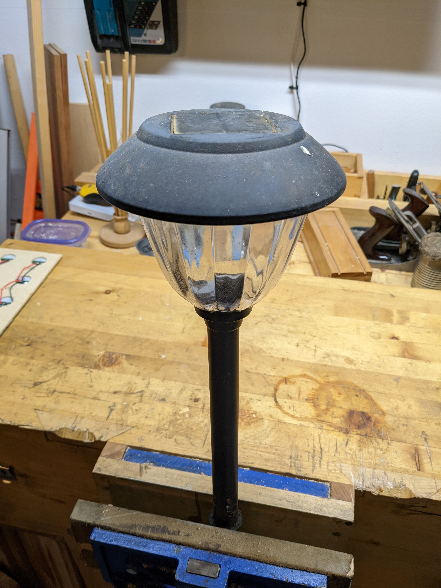

# About

## :goal_net: Objectives

- Recharge li-ion 18650, 9V, and coin batteries via a solar panel.
- Recharge Ni-MH AA and AAA batteries indirectly via a solar panel.
- Make the li-ion battery pack portable to easily recharge other devices.
- Receive notificatinos when the li-ion batteries are fully charged.
- Monitor the rate of charging via an online IOT service such as
  [ThingSpeak][1] or [Adafruit IO][2].
- Learn about solar cells, panels, li-ion, and [Ni-MH batteries][3].
- Visually monitor the battery voltage, current, and capacity during discharge.
- Turn on and off the Powerboost 1000 Basic using button `A` on the OLED.
- Display the current voltage, current, power, and percentage by pressing the
  `A` button on the OLED without uploading to an online service when the
  Feather is in a deep sleep.

## :frame_with_picture: Background

I recently replaced my solar landscape lights with hardwired ones and so I had a
bunch of solar cells that I didn't know what to do with. I decided to salvage
the solar cells to build myself a solar battery charger since I try to use as
many rechargable batteries as possible as well as learn about solar panels and
rechargable batteries. The problem with recharging Ni-MH batteries is that
they're difficult to monitor and prevent overcharging. Therefore, I decided to
create a lithium ion solar charger that then can be used to charge Ni-MH
batteries via existing USB chargers.

## :bulb: Concept

The concept is to create a solar panel and circuit to charge 18650 li-ion
batteries and then use the charged li-ion batteries to charge Ni-MH batteries
via existing USB chargers. The li-ion batteries are to be disconnectable from
the solar panel to make more portable to recharge other devices and batteries.

Monitoring is handled by an Adafruit Feather HUZZAH32 (Feather) that has built in
wifi support which makes it easy to monitor remotely as well as collect data.
The board will monitor when the li-ion battery is charging and when charging is
complete. It can also send notifications when the charge is complete via
ThingSpeak and IFTTT.

## :raised_hand: Current Limitations

- The Feather is using some power during the charging of the li-ion batteries.
- The Feather turns off during high current discharge. See [issue #39][4].
- The charging current becomes high (~500 mA) only when the battery voltage is
  above a certain threshold (~3 VDC). See [issue #40][5].

[1]: https://thingspeak.com/
[2]: https://io.adafruit.com/
[3]: https://en.wikipedia.org/wiki/Nickel%E2%80%93metal_hydride_battery
[4]: https://github.com/nicholaswilde/solar-battery-charger/issues/39
[5]: https://github.com/nicholaswilde/solar-battery-charger/issues/40
