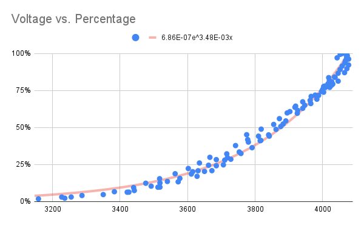

# Calibration

Instead of using a linear fit to calculate the battery percentage, the sketch
uses the [coulomb counting method][1] by using the collection time interval and current
passing to the battery. 

## :chart_with_upwards_trend: Exponential Trendline

The sketch uses an exponetial trendline for a voltage versus percentage to calculate the
battyer percentage.

The formula for the exponential trendline is as follows:

$$
B{\rm e}^{Ax}
$$

The coefficients of the trendline can be found from the equation of the exponential trendline
on the chart.

In this instance, the following coefficients are found:

$$
y=6.86\mathrm{E}{-07}{\rm e}^{3.48\mathrm{E}{-03}x}
$$

$$
B=0.000000686
$$

$$
A=0.00348
$$

These coefficients can then be entered into the `config.h` file as `EXP_A` and `EXP_B`.

!!! note
    The coefficients supplied with the sketch were found using two 3000 mAh batteries.

The maximum and minimum voltages can be found by from this data as well and transcribed
to the `config.h` file in the `VOLTAGE_MAX` and `VOLTAGE_MIN` parameters.

## :page_facing_up: Google Sheet

The scatter plot is created by performing the following steps:

- Collect data from when the batteries are fully depleted to fully charged.
  This can be done either using a solar panel or wall wart.
- Create a column that calculates the time in duration between readings in hours.
- Create a column that multiplies the current by the time duration to get the
  number of coulombs collected in that time interval.
- Create another column that sums the amount of coulombs collected up to that period
  in time.
- Create another column that calculates the percentage by dividing the previous column
  with the maximum number of coulombs collected.
- Create a scatter plot that with the voltage on the X-Axis and percentage on the Y-Axis.
- Add an exponential trendline with the equation in in the legend.
- Transcribe the coefficients of the trendline to the `config.h` file in the `EXP_A` and
  `EXP_B` parameters.

!!! note
    The data collection needs to start when the battery is fully depleted (cut off by the BMS)
    in order to accurately calibrate the system.

## :page_with_curl: Template

WIP ([#57][2])

## :raised_hand: Current Limitations

- The Google Sheet assumes that the current over the collection period is constant.
  Integration of the current versus time would be a better estimation of the amount
  of energy collected.
- The collection at the end of the charge can be a bit erratic and group around the same
  same voltage. This was clipped in my original data.
- The coefficients can only be found by the equation on the scatter plot chart. Have not
  figured out a way to calculate the coefficients in a Sheet cell ([#58][3]).

## :link: References

- https://github.com/rlogiacco/BatterySense#remaining-capacity-approximation
- https://batteryuniversity.com/article/bu-903-how-to-measure-state-of-charge

[1]: https://batteryuniversity.com/article/bu-903-how-to-measure-state-of-charge
[2]: https://github.com/nicholaswilde/solar-battery-charger/issues/57
[3]: https://github.com/nicholaswilde/solar-battery-charger/issues/58
