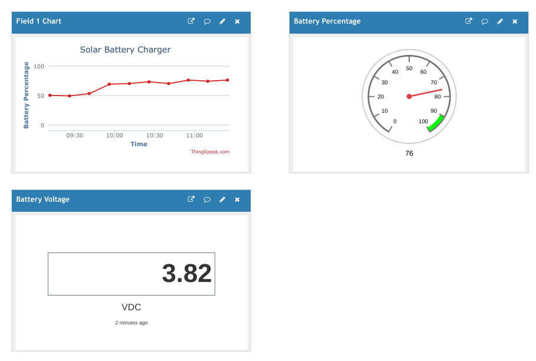
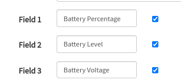

# :gear: Configuration

Because I work mainly out of a Chromebook and Rasperry Pis, this project is
using the `arduino-cli` command line utility [with Linux][1] rather than
the [Arduino IDE][2].

```shell title="Initialize the config"
arduino-cli config init
```

=== "ESP8266"
    ```shell title="Add the ESP8266 package library"
    arduino-cli config add board_manager.additional_urls http://arduino.esp8266.com/stable/package_esp8266com_index.json
    ```

    ```shell title="Check that the update addition was successful."
    cat ~/.arduino15/arduino-cli.yaml
    ```
    !!! note
        This is assuming that `arduino-cli` was installed in the home directory (`~/.arduino15`)

    ```yaml title="~/.arduino15/arduino-cli.yaml"
    board_manager:
      additional_urls:
        - https://arduino.esp8266.com/stable/package_esp8266com_index.json
    ...
    ```

    ```shell title="Update the core index"
    arduino-cli core update-index
    ```

    ```shell title="Install the ESP8266 core"
    arduino-cli core install esp8266:esp8266
    ```

    ```shell title="Search for the huzzah board"
    arduino-cli board search huzzah
    ```

    ```shell title="Typical Output"
    Board Name                      FQBN                   Platform ID
    Adafruit Feather HUZZAH ESP8266 esp8266:esp8266:huzzah esp8266:esp8266
    ```

    Take note of the output under `FQBN` because that is what will need to be passed
    as the `board` (`-b`) parameter with the `arduino-cli` command. In this example,
    the board to be used will be `esp8266:esp8266:huzzah`.

=== "ESP32"
    ```shell title="Add the ESP32 package library"
    arduino-cli config add board_manager.additional_urls https://raw.githubusercontent.com/espressif/arduino-esp32/gh-pages/package_esp32_index.json
    ```

    ```shell title="Check that the update addition was successful."
    cat ~/.arduino15/arduino-cli.yaml
    ```

    !!! note
        This is assuming that `arduino-cli` was installed in the home directory (`~/.arduino15`)

    ```yaml title="~/.arduino15/arduino-cli.yaml"
    board_manager:
      additional_urls:
        - https://raw.githubusercontent.com/espressif/arduino-esp32/gh-pages/package_esp32_index.json
    ...
    ```

    ```shell title="Update the core index"
    arduino-cli core update-index
    ```

    ```shell title="Install the ESP32 core"
    arduino-cli core install esp32:esp32
    ```

    ```shell title="Search for the featheresp32 board"
    arduino-cli board search featheresp32
    ```

    ```shell title="Typical Output"
    Board Name              FQBN                     Platform ID
    Adafruit ESP32 Feather  esp32:esp32:featheresp32 esp32:esp32
    ```

    Take note of the output under `FQBN` because that is what will need to be passed
    as the `board` (`-b`) parameter with the `arduino-cli` command. In this example,
    the board to be used will be `esp32:esp32:featheresp32`.

```shell title="Install the required libraries"
arduino-cli lib install ThingSpeak "Adafruit SH110X" Timezone
```

```shell title="Tested Library Versions"
Name                   Version
Adafruit_SH110X        2.1.6
ThingSpeak             2.0.1
Timezone               1.2.4
```

Create a channel on [ThingSpeak](#thingspeak) and take note of the `Channel ID`,
channel `Write API Key`, and `User API Key`.

Create [`secret.h`](#key-secrets) and update variables in `config.h`.

=== "ESP8266"

    ```shell title="Compile"
    arduino-cli compile -b esp8266:esp8266:huzzah .
    ```

=== "ESP32"
    ```shell title="Compile"
    arduino-cli compile -b esp32:esp32:featheresp32 .
    ```

!!! note
    The dot at the end of the command tells `arduino-cli` to use the sketch in
    the current directory. The name of the sketch may also be used.

```shell title="Typical Output"
Executable segment sizes:
ICACHE : 32768           - flash instruction cache
IROM   : 236116          - code in flash         (default or ICACHE_FLASH_ATTR)
IRAM   : 27273   / 32768 - code in IRAM          (IRAM_ATTR, ISRs...)
DATA   : 1496  )         - initialized variables (global, static) in RAM/HEAP
RODATA : 908   ) / 81920 - constants             (global, static) in RAM/HEAP
BSS    : 25680 )         - zeroed variables      (global, static) in RAM/HEAP
Sketch uses 265793 bytes (25%) of program storage space. Maximum is 1044464 bytes.
Global variables use 28084 bytes (34%) of dynamic memory, leaving 53836 bytes for local variables. Maximum is 81920 bytes.
```

Be sure to compile your code before uploading it if changes have been made to
the sketch!

```shell title="Upload the sketch to the Feather"
arduino-cli upload -p /dev/ttyUSB0 -b esp8266:esp8266:huzzah .
```

```shell title="Typical Output"
esptool.py v3.0
Serial port /dev/ttyUSB0
Connecting........_____.
Chip is ESP8266EX
Features: WiFi
Crystal is 26MHz
MAC: bc:dd:c2:2d:ce:0d
Uploading stub...
Running stub...
Stub running...
Configuring flash size...
Auto-detected Flash size: 4MB
Compressed 269952 bytes to 198163...
Wrote 269952 bytes (198163 compressed) at 0x00000000 in 17.5 seconds (effective 123.5 kbit/s)...
Hash of data verified.

Leaving...
Hard resetting via RTS pin...
```

```shell title="Monitor serial connection using GNU Screen"
screen /dev/ttyUSB0 115200
```

!!! note
    Make sure the baud rate matches the `BAUDE_RATE` in the sketch!

The `recharge` mode is the default mode during boot.

The `A` button on the OLED may be held down during boot to choose the `discharge` mode which
will keep the OLED on and display the battery measurements.

=== "Mode: recharge"

    ```shell title="Typical Output"
    SSID: MySSID
    Connecting.........
    Connected!
    IP: 192.168.1.77
    Hostname: Feather
    Battery:
     Level: 745
     Percentage: 90%
     Voltage: 4.04V
    Channel:
     Number: 1642208
     Status: success
    Sleep time: 15m
    ```
=== "Mode: discharge"
    ```shell title="Typical Output"
    Battery:
     Level: 745
     Percentage: 90%
     Voltage: 4.04V
    ```

Kill the monitoring screen by pressing <kbd>Ctrl</kbd> + <kbd>a</kbd>
<kbd>k</kbd> <kbd>y</kbd>

## :key: Secrets

`secrets.h` is a file used to store secrets such as API tokens and wifi
credentials that aren't updated in GitHub. The file is ignored in `.gitignore`.

```C++ title="secrets.h"
#define SECRET_SSID "MySSID"                   // replace MySSID with your WiFi network name
#define SECRET_PASS "MyPassword"               // replace MyPassword with your WiFi password

#define SECRET_CH_ID 0000000                   // replace 0000000 with your channel number
#define SECRET_WRITE_APIKEY "XYZ"              // replace XYZ with your channel write API Key

#define SECRET_HOSTNAME "Feather"

#define SECRET_USER_APIKEY "ABC"               // replace ABC with ThingSpeak User API Key
```

```C++ title="Secrets can be used in sketches"
#include "secrets.h"
```

The nomenclature used in this project is different than what [arduino-cli][3]
specifies (`arduino_secrets.h`) because this project does not use an Arduino.

### secrets task

[Task](#task) may also be used to generate `secrets.h`.

```shell
task secrets SSID=MySSID PASS=MyPassword CH_ID=0000000 WRITE_APIKEY=XYZ USER_APIKEY=ABC
```

### Overwrite Sketch Header

Instead of using the `secrets.h` file, the include may be commented out at the top of
the sketch and the variable values may be manually written in.

```C++ title="solar-battery-charger.ino"

//#include "secrets.h"

// Pulled from secrets.h
//const char ssid[] = SECRET_SSID; // your network SSID (name)
const char ssid[] = MySSID;
//const char pass[] = SECRET_PASS; // your network password
const char pass[] = MyPassword;
//unsigned long myChannelNumber = SECRET_CH_ID;
unsigned long myChannelNumber = 0000000;
//const char * myWriteAPIKey = SECRET_WRITE_APIKEY;
const char * myWriteAPIKey = "XYZ"
//const char * myUserAPIKey = SECRET_USER_APIKEY;
const char * myUserAPIKey = "ABC"
//const char * myHostName = SECRET_HOSTNAME;
const char * myHostName = "Feather";
```

!!!warning
    This method is not recommended if the sketch is going to be uploaded to a repository!

## Clear Channel

The channel may be [cleared][12] if the `created_at` date of the last data
point is older than the current date. The dates take into account the
current timezone which may be set with `timeZone`. To turn on the clear
channel option, set `doClear` to `true`.

## Metadata

Instead of specifying `-b` and `-p` for every command, a [sketch.json][4] may
be stored in the sketch directory that sets the defaults for that sketch.

The `sketch.json` file may be generated by using the
[arduino-cli board attach][5] command.

=== "ESP8266"
    ```shell
    arduino-cli board attach -b esp8266:esp8266:huzzah .
    arduino-cli board attach -p /dev/ttyUSB0 .
    ```
=== "ESP32"
    ```shell
    arduino-cli board attach -b esp32:esp32:featheresp32 .
    arduino-cli board attach -p /dev/ttyUSB0 .
    ```

Attaching the board didn't work for me because `arduino-cli` didn't recognize
the Feather attached to my port for some reason and so I had to manually add
the port.

!!! note
    The port needs to start with the protocol, e.g. `serial://`.

The documentation doesn't show what a typical `sketch.json` looks like so here is one:

=== "ESP8266"
    ```json title="sketch.json"
    {
      "cpu": {
        "fqbn": "esp8266:esp8266:huzzah",
        "port": "serial:///dev/ttyUSB0"
      }
    }
    ```

=== "ESP32"
    ```json title="sketch.json"
    {
      "cpu": {
        "fqbn": "es32:esp32:featheresp32",
        "port": "serial:///dev/ttyUSB0"
      }
    }
    ```

## :speech_balloon: ThingSpeak

The results are exported to a [ThingSpeak][6] public channel which can be
seen [here][7].

The channel `Write API Key` (`SECRET_WRITE_APIKEY`) can be found in the API
Keys tab on the channel page.

The `Channel ID` (`SECRET_CH_ID`) can be found on at the top of the channel
page.



### :satellite: Fields

On the `Channel Settings` tab of the channel, create 3 fields for the battery
percentage, level, and voltage.



### :chart_with_upwards_trend: Visualizations & Widgets

Add whichever visualizations and widgets you'd like.

### :pager: Notification from IFTTT

Notifications from [IFTTT][8] can be setup by connecting ThingSpeak to IFTTT.
See [these instructions][9].

## :robot: Task

[go-task][10] may be used to automate some of the commands.

Update the parameters in `task.env`.

!!! note
    Variables are duplicated both in `task.env` and `sketch.json` because I couldn't get
    go-task to not have errors when trying to parse `sketch.json` when it didn't exist.

```shell title="Bootstrap the entire environment (not including the installation of arduino-cli)"
task bootstrap
```

!!! warning
    This will overwrite your entire `arduino-cli` config file!

```shell title="Compile, upload, and monitor the sketch."
task compile-upload
```

```shell title="Get a list of all of the commands."
task
```

[1]: https://support.google.com/chromebook/answer/9145439?hl=en
[2]: https://www.arduino.cc/en/software
[3]: https://arduino.github.io/arduino-cli/0.20/sketch-specification/#secrets
[4]: https://arduino.github.io/arduino-cli/0.20/sketch-specification/#metadata
[5]: https://arduino.github.io/arduino-cli/0.20/commands/arduino-cli_board_attach/
[6]: https://thingspeak.com/
[7]: https://thingspeak.com/channels/1642208
[8]: https://ifttt.com/
[9]: https://www.mathworks.com/help/thingspeak/use-ifttt-to-send-text-message-notification.html
[10]: https://github.com/go-task/task
[11]: https://www.a2hosting.com/kb/security/ssl/a2-hostings-ssl-certificate-fingerprints
[12]: https://www.mathworks.com/help/thingspeak/clearchannel.html
