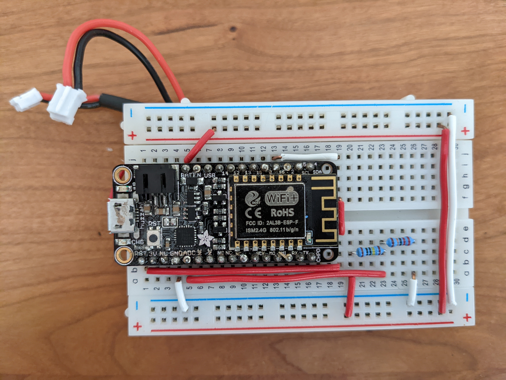
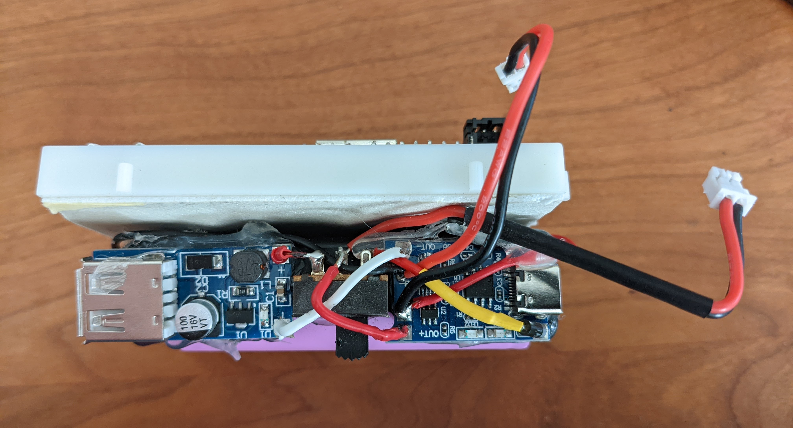
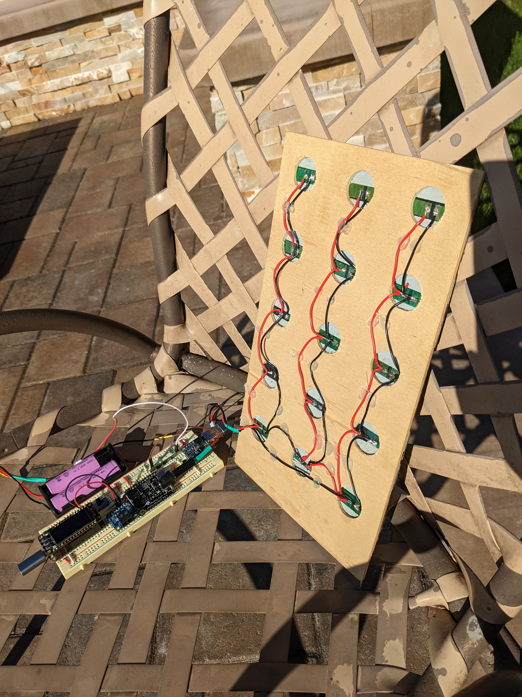
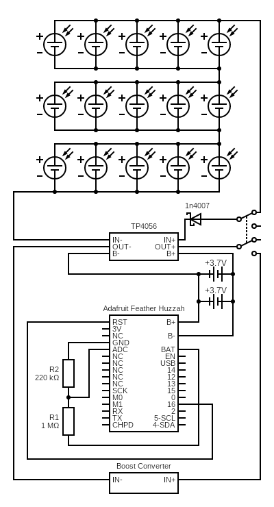

# Design

## :desktop_computer: Hardware
- 15X [Energizer LED Solar pathway Lights](https://outdoorsolaroutlet.com/products/new-led-energizer-10pack-solar-pathway-lights-outdoor-stainless-steel-bronze)
- 1X [Adafruit Feather Huzzah ESP8266](https://learn.adafruit.com/adafruit-feather-huzzah-esp8266/)
- 1X [Adafruit 128x64 OLED FeatherWing](https://www.adafruit.com/product/4650)
- 2X [IMREN 3.7v 18650 Rechargeable Battery 3000mAh](https://www.amazon.com/gp/product/B09L5M1WN6/)
- 1X [NITECORE UMS2 Charger](https://www.amazon.com/gp/product/B07JN49XYM/)
- 1X [HiLetgo TP4056 Type-C USB 5V 1A 18650 Lithium Battery Charger Module](https://www.amazon.com/gp/product/B07PKND8KG/)
- 1X [DC-DC 0.9V-5V to USB 5V Boost Step-up Power Supply Module Booster Circuit Board](https://www.amazon.com/gp/product/B07QKYHFJB/)
- 1X [18650 2 Battery Holder 7.4V](https://www.amazon.com/gp/product/B08B86KHB2/)
- 1X [1N4007 Schottky Diode](https://www.amazon.com/gp/product/B07Q5FZR7X/)
- 1X [EBL 9V Li-ion Battery Charger](https://www.amazon.com/gp/product/B00HV4KFSA/)
- 1X [CT-Energy Lithium Coin Button Batteries Charger](https://www.amazon.com/gp/product/B088ZB9YZT/)
- 1X [Lithium Ion Polymer Battery - 3.7v 500mAh](https://www.adafruit.com/product/1578)
- 1X [220kΩ Resistor](https://www.amazon.com/gp/product/B072BL2VX1/)
- 1X [1MΩ Resistor](https://www.amazon.com/gp/product/B072BL2VX1/)
- 2X [JST-PH 2.0 Male and Female Connector Cable](https://www.amazon.com/gp/product/B07NWD5NTN)
- 1X [DPDT 2 Position 6 Terminals Panel Mount Horizontal Slide Switch](https://www.amazon.com/gp/product/B01N6ROMW3)

### :zap: Electronics

<figure Markdown>
  {width=480}
</figure>

<figure Markdown>
  {width=480}
</figure>

<figure Markdown>
  {width=480}
</figure>

### :sunny: Panel

<figure Markdown>
  {width=480}
</figure>

<figure Markdown>
  {width=480}
</figure>

## :robot: Services
- [IFTTT](https://ifttt.com/)
- [ThingSpeak](https://thingspeak.com/)

## :floppy_disk: Software
- [arduino-cli](https://arduino.github.io/arduino-cli/latest/installation)
- [ubuntu server](https://ubuntu.com/download/server)
- [go-task](https://github.com/go-task/task)
- [GNU Screen](https://www.gnu.org/software/screen/)
- [jq](https://stedolan.github.io/jq) (for go-task)

## :electric_plug: Circuit

- Connect the `RST` pin to pin `16` to allow the [Feather to wake from deep sleep](https://learnarduinonow.com/2018/07/05/esp8266-deep-sleep-mode.html).
- Create a voltage divider and connect the `A0` analog pin to the connection point.
- Connect a DPDT switch which allows power from the solar panel and no power to the output and vice versa.
- Insert a schottky diode between the solar panel and the `TP4056` input.

Circuits made with [Circuit Diagram](https://www.circuit-diagram.org/)

!!! note
    The li-ion batteries are wired in parallel even though the 2 battery holder
    come wired in series.
