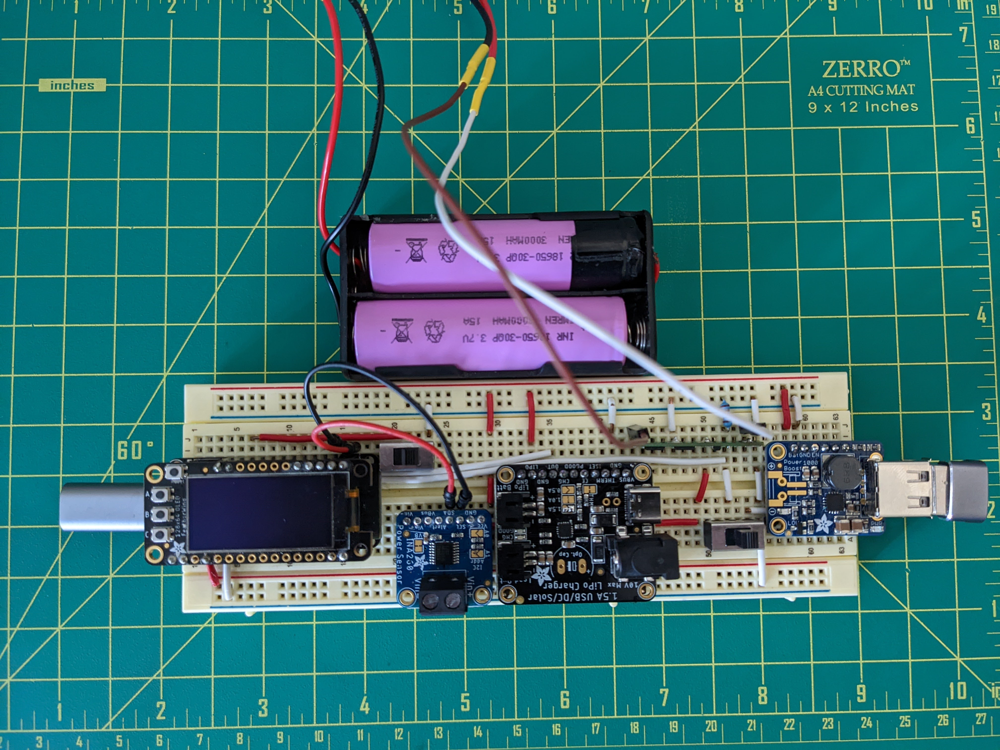
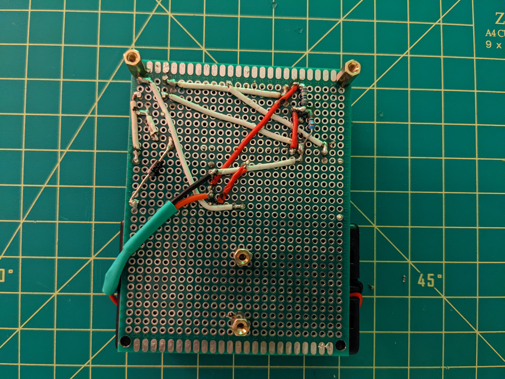

# Design

## :desktop_computer: Hardware
- 15X [Energizer LED Solar pathway Lights][1]
- 1X [Adafruit Feather HUZZAH ESP8266][2] or [Adafruit Feather HUZZAH32 ESP32][24]
- 1X [Adafruit 128x64 OLED FeatherWing][3]
- 2X [IMREN 3.7v 18650 Rechargeable Battery 3000mAh][4]
- 1X [NITECORE UMS2 Charger][5]
- 1X [HiLetgo TP4056 Type-C USB 5V 1A 18650 Lithium Battery Charger Module][6]
- 1X [DC-DC 0.9V-5V to USB 5V Boost Step-up Power Supply Module Booster Circuit Board][7]
- 1X [18650 2 Battery Holder 7.4V][8]
- 1X [1N4007 Schottky Diode][9]
- 1X [EBL 9V Li-ion Battery Charger][10]
- 1X [CT-Energy Lithium Coin Button Batteries Charger][11]
- 1X [220kΩ Resistor][13]
- 1X [1MΩ Resistor][13]
- 1X [Adafruit Feather Stacking Headers - 12-pin and 16-pin female headers][18]
- 1X [DEYUE PCB 7cm x 9cm][19]
- 2X [Cylewet 5mm High Knob Vertical Slide Switch 3 Pin 2 Position 1P2T SPDT Panel][20]
- 4X [Sutemribor M2.5 x 10mm F-F Hex Brass Spacer Standoff & Screw][21]
- 1X [AiTrip 3 Pin DC Power Connector PCB Mount Female Plug Jack 5.5mm][22]

!!! warning
    The current design uses a boost converter that only has rear pins which
    causes the boost converter to pivot when plugging in a charging USB cable
    into it.

### :zap: Electronics

<figure Markdown>
  {width=480}
</figure>

<figure Markdown>
  {width=480}
</figure>

### :sunny: Panel

<figure Markdown>
  {width=480}
</figure>

<figure Markdown>
  {width=480}
</figure>

## :robot: Services
- [IFTTT](https://ifttt.com/)
- [ThingSpeak](https://thingspeak.com/)

## :floppy_disk: Software
- [arduino-cli](https://arduino.github.io/arduino-cli/latest/installation)
- [ubuntu server](https://ubuntu.com/download/server)
- [go-task](https://github.com/go-task/task)
- [GNU Screen](https://www.gnu.org/software/screen/)
- [jq](https://stedolan.github.io/jq) (for go-task)
- [pre-commit](https://pre-commit.com/)
- [arduino-lint](https://arduino.github.io/arduino-lint/)
- [yamllint](https://github.com/adrienverge/yamllint)

## :electric_plug: Circuit

- Connect the `RST` pin to pin `16` to allow the [Feather to wake from deep sleep][16].
- Create a voltage divider and connect the `A0` analog pin to the connection
  point.
- Connect a 1P2T switch which allows power from the solar panel and no power to
  the output and vice versa. File the legs to be narrow enough to fit into the
  board holes.
- Connect a 1P2T switch which allows the grounding of the Feather to turn it
  off. File the legs to be narrow enough to fit into the board holes.
- Insert a schottky diode between the solar panel and the `TP4056` input.
- Drill two 0.109" holes in the circuit board to mount the battery holder.
- Clip off the outset leg of the power connector and file the edges of the
  remaining two legs until they are narrow enough to fit inside of the
  PCB mounting holes.

Circuits made with [Circuit Diagram](https://www.circuit-diagram.org/)

!!! note
    The li-ion batteries are wired in parallel even though the 2 battery holder
    come wired in series.

!!! note
    The JST pins, depending on where they are purchased, may be backwards in
    terms of the wiring. See [this link][23] to determine the correct wiring
    according to IoT convention.

IoT devices must use batteries wired like this: With the key facing down and
the wires toward you, the red is on the right.

<figure Markdown>
  {width=480}
</figure>

[1]: https://outdoorsolaroutlet.com/products/new-led-energizer-10pack-solar-pathway-lights-outdoor-stainless-steel-bronze
[2]: https://learn.adafruit.com/adafruit-feather-huzzah-esp8266/
[3]: https://www.adafruit.com/product/4650
[4]: https://www.amazon.com/gp/product/B09L5M1WN6/
[5]: https://www.amazon.com/gp/product/B07JN49XYM/
[6]: https://www.amazon.com/gp/product/B07PKND8KG/
[7]: https://www.amazon.com/gp/product/B07QKYHFJB/
[8]: https://www.amazon.com/gp/product/B08B86KHB2/
[9]: https://www.amazon.com/gp/product/B07Q5FZR7X/
[10]: https://www.amazon.com/gp/product/B00HV4KFSA/
[11]: https://www.amazon.com/gp/product/B088ZB9YZT/
[12]: https://www.adafruit.com/product/1578
[13]: https://www.amazon.com/gp/product/B072BL2VX1/
[14]: https://www.amazon.com/gp/product/B07NWD5NTN/
[15]: https://www.amazon.com/gp/product/B01N6ROMW3/
[16]: https://learnarduinonow.com/2018/07/05/esp8266-deep-sleep-mode.html
[17]: https://www.amazon.com/dp/B07PCJP9DY/
[18]: https://www.amazon.com/dp/B01ABIT8FI/
[19]: https://www.amazon.com/dp/B07FFDFLZ3/
[20]: https://www.amazon.com/dp/B07FVM3XYR/
[21]: https://www.amazon.com/dp/B075K3QBMX/
[22]: https://www.amazon.com/dp/B081DYQSC9/
[23]: https://docs.particle.io/tutorials/learn-more/batteries/
[24]: https://www.adafruit.com/product/3405
