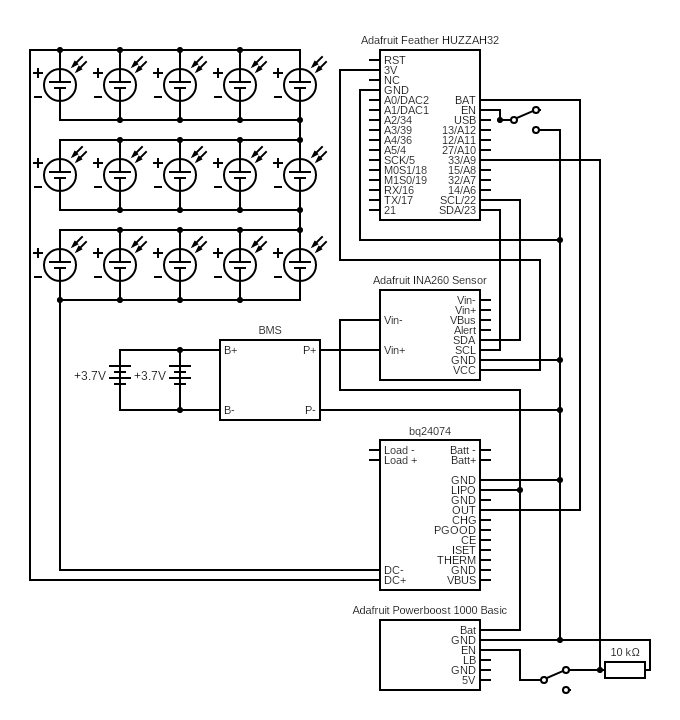

# Design

## :desktop_computer: Hardware
- 15X [Energizer LED Solar pathway Lights][1]
- 1X [Adafruit Feather HUZZAH32 ESP32][24]
- 1X [Adafruit 128x64 OLED FeatherWing][3]
- 1X [Adafruit INA260 Current + Voltage + Power Sensor Breakout][25]
- 1X [Adafruit Universal USB / DC / Solar Lithium Ion/Polymer charger - bq24074][26]
- 1X [Adafruit PowerBoost 1000 Basic - 5V USB Boost][28]
- 2X [IMREN 3.7v 18650 Rechargeable Battery 3000mAh][4]
- 1X [NITECORE UMS2 Charger][5]
- 1X [18650 2 Battery Holder 7.4V][8]
- 1X [EBL 9V Li-ion Battery Charger][10]
- 1X [CT-Energy Lithium Coin Button Batteries Charger][11]
- 1X [10kΩ Resistor][13]
- 1X [Adafruit Feather Stacking Headers - 12-pin and 16-pin female headers][18]
- 2X [Cylewet 5mm High Knob Vertical Slide Switch 3 Pin 2 Position 1P2T SPDT Panel][20]
- 4X [Sutemribor M2.5 x 10mm F-F Hex Brass Spacer Standoff & Screw][21]
- 1X [ELEGOO 3pcs Breadboard 830 Point Solderless Prototype PCB Board Kit][27]
- 1X [Anmbest 5PCS 1S 3.7V 4A 18650 Charger PCB BMS Protection Board][29]

!!! note
    If the output from the battery turns off, it may be because the BMS needs to be
    reset. This may be done by shorting the `P-` and `B-` on the BMS.

I opted to drop support for the `ESP8266` for a few reasons:
- The need to short pin `16` in order to wake the Feather from deeps sleep removes the
  ability to use button `B` on the OLED screen.
- Button `A` on the OLED screen was tied to the Feather LED.
- There is no way to determine the method that was uesd to wake the Feather.

### :zap: Electronics

<figure Markdown>
  {width=480}
</figure>

<figure Markdown>
  {width=480}
</figure>

### :sunny: Panel

<figure Markdown>
  {width=480}
</figure>

<figure Markdown>
  {width=480}
</figure>

### :battery: BMS

The BMS is really small and can be difficult to mount and use. I thought about hot gluing
it to the battery holder and then soldering the wires to it directly. However, I opted
against it because I was too afraid that the wires soldered to the `P+` and `P-` and
going to the rest of the breadboard would break off easily. Therefore, I soldered pins
to the BMS pads and connected it to the system via the breadboard.

<figure Markdown>
  {width=480}
</figure>

I used the standard header pins that come with a lot of the Arduino type boards and just
removed the plastic spacer. I then added pre-tinned the pins as well as the BMS pads. I
then inserted the pins into the breadboard at the correct locations then clamped the
outer pins to the BMS using a set of helping hands. Then soldered the pins to the pads.

<figure Markdown>
  {width=480}
</figure>

## :robot: Services
- [IFTTT](https://ifttt.com/)
- [ThingSpeak](https://thingspeak.com/)

## :floppy_disk: Software
- [arduino-cli](https://arduino.github.io/arduino-cli/latest/installation)
- [ubuntu server](https://ubuntu.com/download/server)
- [go-task](https://github.com/go-task/task)
- [GNU Screen](https://www.gnu.org/software/screen/)
- [jq](https://stedolan.github.io/jq) (for go-task)
- [pre-commit](https://pre-commit.com/)
- [arduino-lint](https://arduino.github.io/arduino-lint/)
- [yamllint](https://github.com/adrienverge/yamllint)

## :electric_plug: Circuit

- Connect the output of the battery to the `Vin+` of the INA260.
- Connect the `Vin-` of the INA260 to the `LIPO` pin of the bq24074.
- Connect the `BAT` pin of the Feather to the `OUT` pin of the bq24074.
- Connect a 1P2T switch to the `EN` pin of the Feather to ground.
- Connect a 1P2T switch to the `EN` pin of the Powerboost and a `10kΩ` resistor.
- Connect pin 33 of the Feather to a node between the Powerboost switch and the `10kΩ` resistor.
- Connect all `GND` pins together.
- Connect the `SCL` and `SCA` pins of the Feather to the `SCL` and `SCA` pins of the INA260.
- Connect the `3V` pin of the Feather to the `VCC` pin of the INA260.
- Connect the BMS in between the battery, ground, and `V+` of the INA260.

Circuits made with [Circuit Diagram](https://www.circuit-diagram.org/)

!!! warning
    The li-ion batteries are wired in parallel even though the 2 battery holder
    come wired in series.

!!! warning
    The JST pins, depending on where they are purchased, may be backwards in
    terms of the wiring. See [this link][23] to determine the correct wiring
    according to IoT convention.

IoT devices must use batteries wired like this: With the key facing down and
the wires toward you, the red is on the right.

<figure Markdown>
  {width=480}
</figure>

[1]: https://outdoorsolaroutlet.com/products/new-led-energizer-10pack-solar-pathway-lights-outdoor-stainless-steel-bronze
[2]: https://learn.adafruit.com/adafruit-feather-huzzah-esp8266/
[3]: https://www.adafruit.com/product/4650
[4]: https://www.amazon.com/gp/product/B09L5M1WN6/
[5]: https://www.amazon.com/gp/product/B07JN49XYM/
[6]: https://www.amazon.com/gp/product/B07PKND8KG/
[7]: https://www.amazon.com/gp/product/B07QKYHFJB/
[8]: https://www.amazon.com/gp/product/B08B86KHB2/
[9]: https://www.amazon.com/gp/product/B07Q5FZR7X/
[10]: https://www.amazon.com/gp/product/B00HV4KFSA/
[11]: https://www.amazon.com/gp/product/B088ZB9YZT/
[12]: https://www.adafruit.com/product/1578
[13]: https://www.amazon.com/gp/product/B072BL2VX1/
[14]: https://www.amazon.com/gp/product/B07NWD5NTN/
[15]: https://www.amazon.com/gp/product/B01N6ROMW3/
[16]: https://learnarduinonow.com/2018/07/05/esp8266-deep-sleep-mode.html
[17]: https://www.amazon.com/dp/B07PCJP9DY/
[18]: https://www.amazon.com/dp/B01ABIT8FI/
[19]: https://www.amazon.com/dp/B07FFDFLZ3/
[20]: https://www.amazon.com/dp/B07FVM3XYR/
[21]: https://www.amazon.com/dp/B075K3QBMX/
[22]: https://www.amazon.com/dp/B081DYQSC9/
[23]: https://docs.particle.io/tutorials/learn-more/batteries/
[24]: https://www.adafruit.com/product/3405
[25]: https://www.adafruit.com/product/4226
[26]: https://www.adafruit.com/product/4755
[27]: https://www.amazon.com/dp/B01EV6LJ7G/
[28]: https://www.adafruit.com/product/2030/
[29]: https://www.amazon.com/dp/B07KSPYMJ2/
