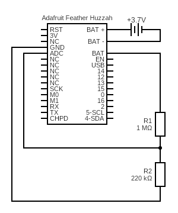

# battery

Reads value on analog input A0 and calculates the the percent level of a lipo battery.

## Sketch

Sketch can be found [here](https://github.com/nicholaswilde/solar-battery-charger/tree/main/test/battery).

## Hypothesis

The Adafruit Feather Huzzah can be used to monitor the level of a lipo battery.

## Assumptions

WIP

## Procedure

### Circuit

Connect a 3.7V lipo battery to the Adafruit Feather Huzzah and create a 
voltage divider using a `1MΩ` and `220kΩ` resistor.



Circuit made with [Circuit Diagram](https://www.circuit-diagram.org/)

### Code

WIP

### Output
```bash
Battery level: 62%
Battery level: 62%
Battery level: 62%
Battery level: 62%
...
```

## Analysis

WIP

## Conclusion

WIP

## Troubleshooting

WIP

## References
- https://learn.adafruit.com/using-ifttt-with-adafruit-io/wiring#battery-tracking
