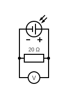
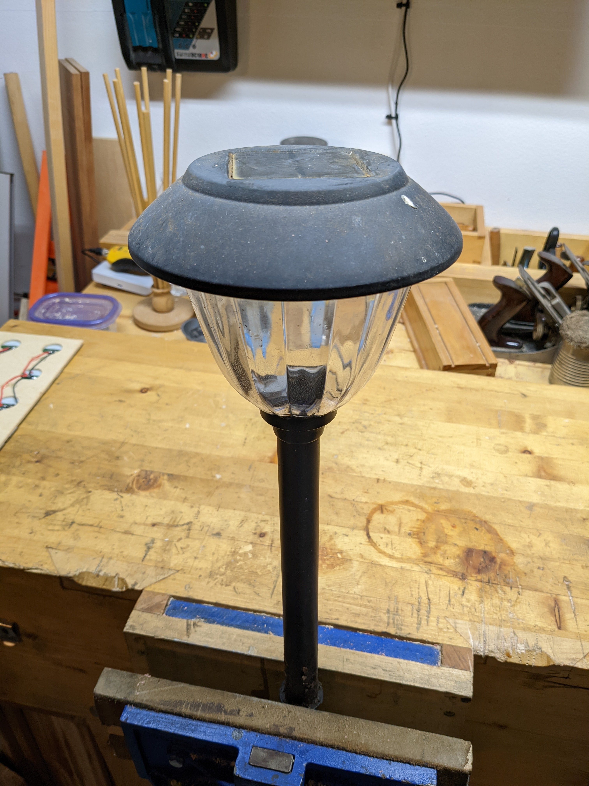
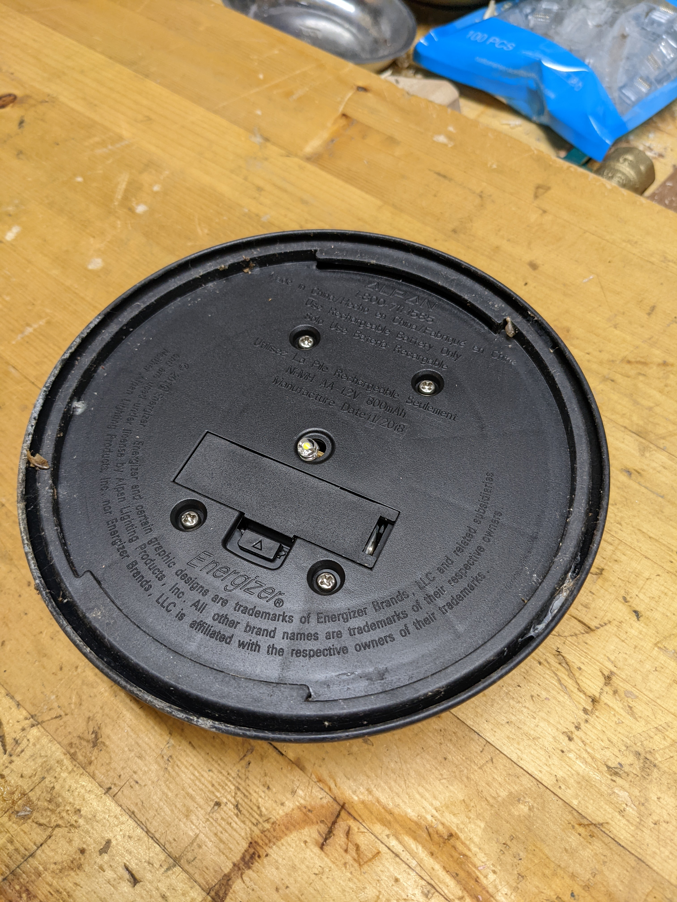
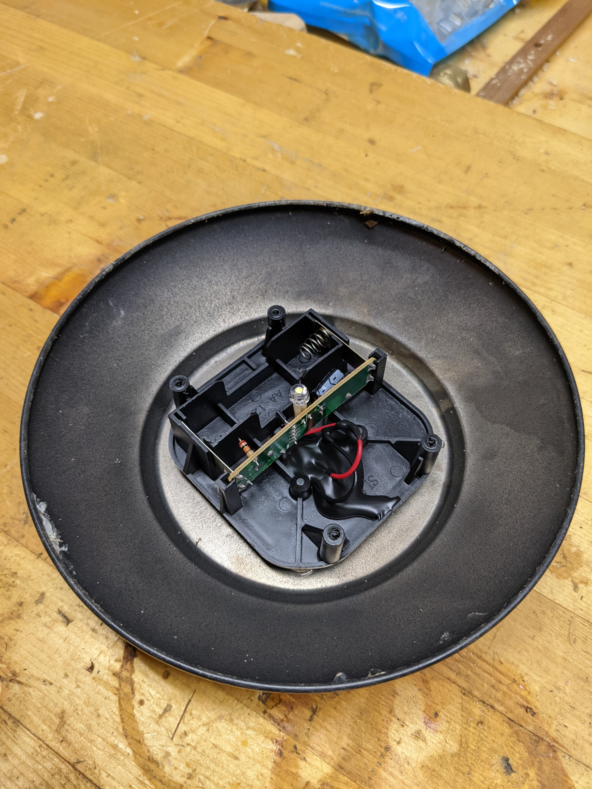
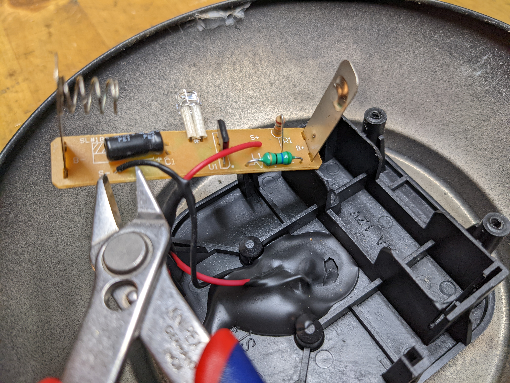
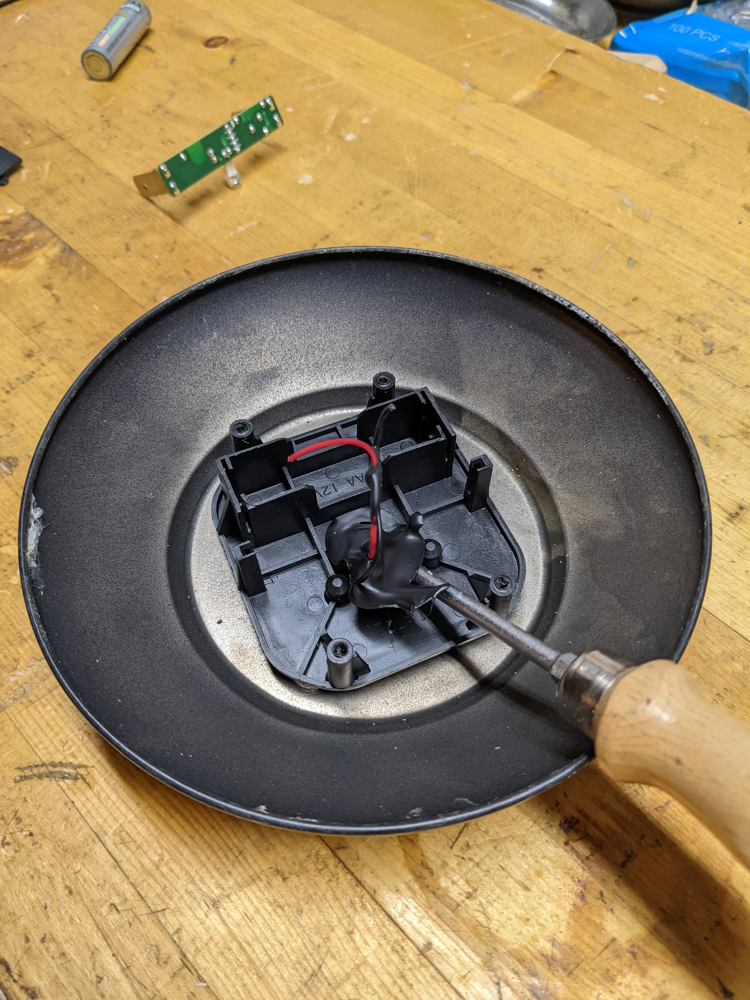
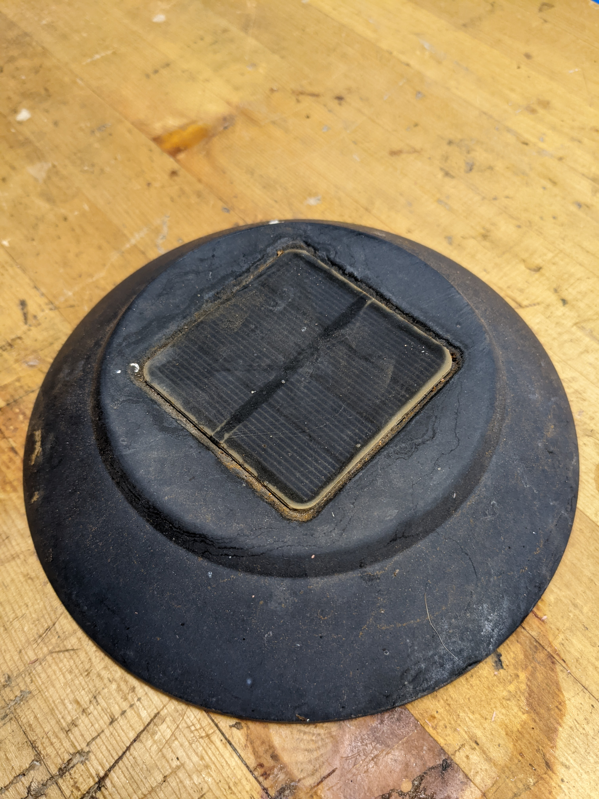
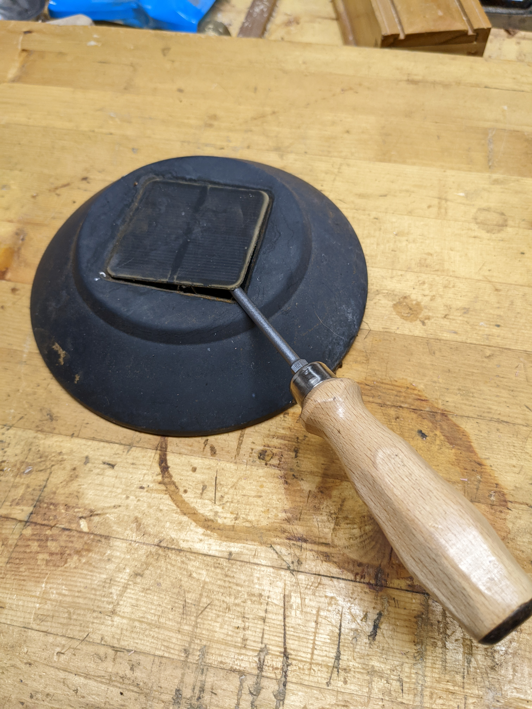
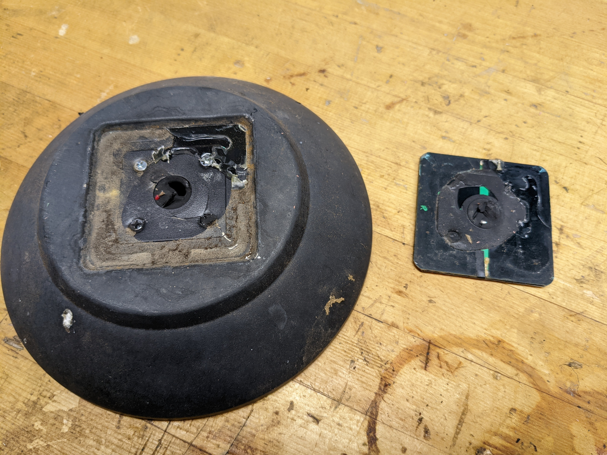
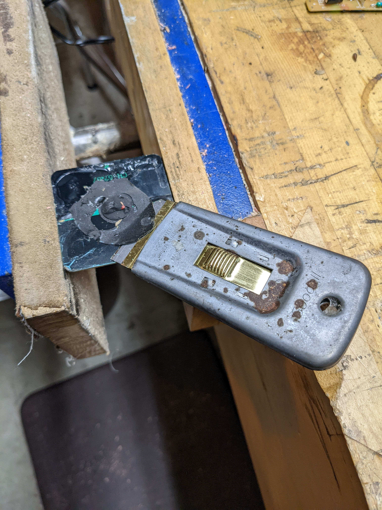

# cell

Measure the voltage and current of a single solar panel cell.

## Hypothesis

The output of a single solar cell is around 2V and 200 mA based on a similar
sized cell.

The solar cells were salvaged from some outdoor solar landscape lights that were replaced
by hardwired ones. The voltage and current of the cells were unknown and so this test is
meant to measure them. The cells are `57mm x 57mm` and [these ones on Amazon](https://www.amazon.com/dp/B087TK7T7T/)
are `50mm x 50mm` which is similar in size. The Amazon ones are `2V` and `160mA` and so I estimated that
the 57mm ones are around `2V` and `200 mA`.

## Assumptions
- The multimeter is accurate.
- Ohm's Law is valid.
- The resistor can handle the power dissipation.
- The average solar radiation intensity at latitude 33.6020861 is 1000 W/m2.

## Procedure

### Circuit

Connect a 20Ω resistor to a solar cell.

Circuit made with [Circuit Diagram](https://www.circuit-diagram.org/)

### Output

Measure the actual resistance of the resistor.

Measure the voltage across the resistor when the cell is in direct sun light.

$$
Resistance=20Ω
$$

$$
Voltage=2.212V
$$

## Analysis

### Current

The current through the resistor can be calculated using [Ohm's law](https://en.wikipedia.org/wiki/Ohm%27s_law).

$$
I=\frac{V}{R}
$$

Using our measure values.

$$
I=\frac{2.212V}{20Ω}
$$

$$
\boxed{I=0.111A}
$$

### Power

The [power](https://en.wikipedia.org/wiki/Power_%28physics%29) through the resistor can be calculated using the following formula.

$$
P=IV
$$

Using our measure values.

$$
P=0.111A\times2.212V
$$

$$
\boxed{P=0.25W}
$$

### Efficiency

According to [this site](https://www.whoi.edu/science/AOPE/mvco/description/SolRad.html), the average solar radiation intensity is
"1000 W/m2 on a clear day at solar noon in the summer months" at the Woods Hole Oceanographic Institution lattitude which is, 41.5255063.

$$
solar\;radiation\;intensity = 1000 \frac{W}{m^2}
$$

I know that there are a lot of factors that go into this value but this can be used as a very rough starting point.

$$
solar\;radiation\;intensity=\frac{0.25W}{(57mm)^2}\times\frac{(1000mm)^2}{1m^2}
$$

$$
\boxed{solar\;radiation\;intensity=77\frac{W}{m^2}}
$$

$$
efficiency=\frac{77\frac{W}{m^2}}{1000\frac{W}{m^2}}
$$

$$
\boxed{efficiency=7.7\%}
$$

## Conclusion

The overall voltage, current, and power of the cell was less than expecting when
compared to the smaller one found on Amazon. Some reasons include the cell being cloudy and dirty,
therefore not allowing the most light to get to the solar cells and the light intensity outside during testing
was not the same as what the Amazon cells were tested at.

Overall, these cells should be sufficient and a good starting point to design the [solar panel](../panel/).

## Troubleshooting

WIP

## Deconstruction

As stated above, the solare cells were salvaged from outdoor solar LED lights.

{ width="480" }

Remove the top of the light from the glass housing.

{ width="480" }

Remove the lid by unscrewing the philips screws.

{ width="480" }

Snip the wires to the solar cell.

{ width="480" }

Remove the caulking with a flathead screwdriver.

{ width="480" }

The top of the light with the solar cell.

{ width="480" }

Use a flathead screwdriver to pry underneath the cell to dislodge the adhesive.
It's easiest if the top is rotated while holding the screwdriver.

{ width="480" }

The solar cell removed from the top.

{ width="480" }

Use a razor blade to remove the rest of the adhesive and caulking.
A wire brush and a little water can also be used to remove the rest of the caulking.

{ width="480" }

## References

WIP
