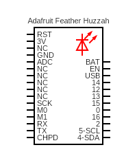

# date

Connect to an NTP server and get the date.

## Sketch

The sketch can be found [here](https://github.com/nicholaswilde/solar-battery-charger/tree/main/test/date).

## Hypothesis

WIP

## Assumptions

WIP

## Procedure

WIP

### Circuit



Circuit made with [Circuit Diagram](https://www.circuit-diagram.org/)

### Code

WIP

### Output

```shell title="Typical Output"
test: date
Connecting to SSID: MySSID
...connected
IP Address: 192.168.1.77
Hostname: ESP-2DCE0D
Starting UDP
Local port: 8888
Waiting for sync
Transmitting NTP Request
us.pool.ntp.org: 64.79.100.197
Receiving NTP Response
date: 2022-02-07T03:50:59Z
Going to sleep for 1 minutes
```

## Analysis

WIP

## Conclusion

WIP

## References
- https://github.com/PaulStoffregen/Time/blob/a18e50dcea4ee17285d732d39e7bc559482d1d3d/examples/TimeNTP_ESP8266WiFi/TimeNTP_ESP8266WiFi.ino
