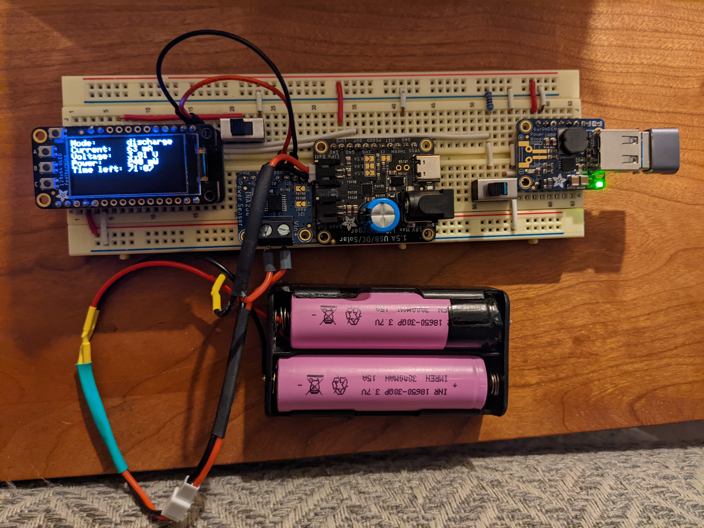

# ina260

Test the voltage, current, and power readings of the Adafruit INA260 High or Low
Side Voltage, Current, Power Sensor.

## Sketch

The sketch can be found [here][1].

## Hypothesis

All of the Adafruit circuit boards can be strung together to monitor the current,
voltage, and power of the battery.

The mode is set to recharge when the current is negative and discharge when the
current is positive.

The `A` button on the OLED is used to turn the Powerboost on and off.

All measurements are taken right in front of the batteries and so all are accurate.

## Assumptions

WIP

## Procedure

### Circuit

[Adafruit Feather HUZZAH32][5] with 3.7V lipo battery, [Adafruit 128x64 OLED][7], [Adafruit
Powerboost 1000 Basic][3], [Adafruit Adafruit INA260 High or Low Side Voltage, Current, 
Power Sensor][4] and [Adafruit bq24074 solar charger][6].


Circuit made with [Circuit Diagram][2].

<figure markdown>
  {width="720"}
</figure>

### Code

```shell
task test:compile-upload NAME=ina260
```

### Output

```shell
Adafruit INA260 Test
Found INA260 chip
Mode:      recharge
Current:   21 mA
Voltage:   2.19 V
Power:     50 mW
Time left: 367:34

Mode:      recharge
Current:   21 mA
Voltage:   2.19 V
Power:     50 mW
Time left: 367:34
```

## Analysis

WIP

## Conclusion

WIP

## References

WIP

[1]: https://github.com/nicholaswilde/solar-battery-charger/tree/main/test/ina260
[2]: https://www.circuit-diagram.org/
[3]: https://www.adafruit.com/product/2030
[4]: https://www.adafruit.com/product/4226
[5]: https://www.adafruit.com/product/3405
[6]: https://www.adafruit.com/product/4755
[7]: https://www.adafruit.com/product/4650
