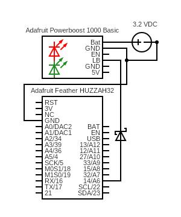

# lbo

Monitor the LBO pin on Adafruit Powerboost using a Feather.

## Sketch

The sketch can be found [here][1].

## Hypothesis

WIP

## Assumptions

WIP

## Procedure

### Circuit

Connect pin `14` of the Feather to the `LBO` pin of the Powerboost with a diode
in between.

Connect an adjustable power supply to the `Bat` and `GND` pins of the Powerboost
with a voltage of 3.2 VDC so that the low batter LED turns on.



Circuit made with [Circuit Diagram][2].

### Code

```shell
task test:compile-upload NAME=lbo
```

### Output

WIP

## Analysis

WIP

## Conclusion

WIP

## References

WIP

[1]: https://github.com/nicholaswilde/solar-battery-charger/tree/main/test/lbo
[2]: https://www.circuit-diagram.org/
