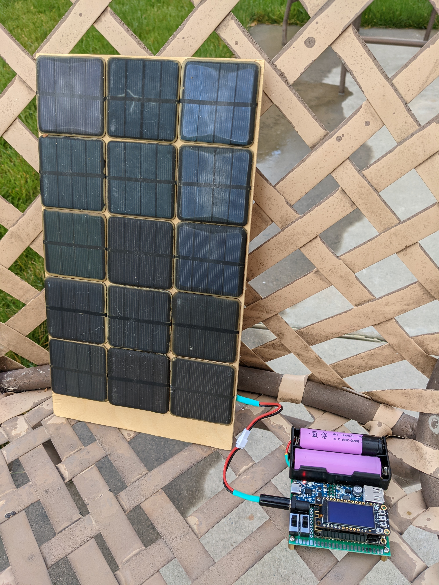
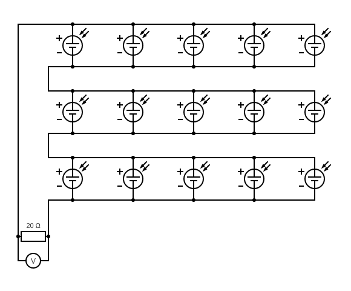

# panel

Measure the voltage and current of a solar panel made of multiple solar cells.

<figure markdown>
  {width="480"}
</figure>

<figure markdown>
  {width="480"}
</figure>

## Hypothesis

The output of a solar panel is around `7.5V` and `500mA` made from 15 solar cells with an output of `2.5V` and `100mA`.

The salvaged solar cells are to wired up in series and parallel to create solare panel that would
produce more voltage and current needed for the `TP4056`. 

## Assumptions

WIP

## Procedure

### Circuit

There are 3 rows of cells that are wired in series and each row is wired in parallel.

Each row consists of 5 cells wired in paralle with an output of `2.5V` at `500mA` which makes the panel a total of `7.5V` at `500mA` for the entire panel.

Connect a `20Ω` resistor to the solar panel.

Circuit made with [Circuit Diagram](https://www.circuit-diagram.org/)

### Output

Measure the actual resistance of the resistor.

Measure the voltage across the resistor when the cell is in direct sun light.

$$
Resistance=20Ω
$$

$$
Voltage=6.8V
$$

## Analysis

The current through the resistor can be calculated using [Ohm's law](https://en.wikipedia.org/wiki/Ohm%27s_law).

$$
I=\frac{V}{R}
$$

Using our measure values.

$$
I=\frac{6.8V}{20Ω}
$$

$$
\boxed{I=0.34A}
$$

### Power

The [power](https://en.wikipedia.org/wiki/Power_%28physics%29) through the resistor can be calculated using the following formula.

$$
P=IV
$$

Using our measure values.

$$
P=0.34A\times6.8V
$$

$$
\boxed{P=2.3W}
$$

### Efficiency

According to [this site](https://www.whoi.edu/science/AOPE/mvco/description/SolRad.html), the average solar radiation intensity is
"1000 W/m2 on a clear day at solar noon in the summer months" at the Woods Hole Oceanographic Institution lattitude which is, 41.5255063.

$$
solar\;radiation\;intensity = 1000\frac{W}{m^2}
$$

I know that there are a lot of factors that go into this value but this can be used as a very rough starting point.

Solar cell radiation intensity

$$
solar\;radiation\;intensity=\frac{2.3W}{\frac{(57mm)^2}{cell}\times15cells}\times\frac{(1000mm)^2}{1m^2}
$$

$$
\boxed{solar\;radiation\;intensity=47\frac{W}{m^2}}
$$

$$
efficiency=\frac{47\frac{W}{m^2}}{1000\frac{W}{m^2}}
$$

$$
\boxed{efficiency=4.7\%}
$$

## Conclusion

WIP

## Troubleshooting

WIP

## References

WIP
