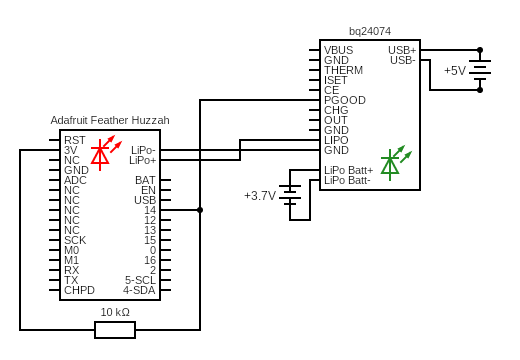

# pgood

Reads the state of the `PGOOD` pin on the [bq24074][3].

## Sketch

The sketch can be found [here][1].

## Hypothesis

The `PGOOD` pin is pulled to `GND` when the LiPo battery on the bq24074 is
fully charged. The Feather can be used to read the state of that pin to
determine if the battery is fully charged.

One potential problem is that the pulled high resistor on `pin 14` can cause
issues to the `PGOOD` pin.

This method theoretically can use the Feather to also read the state of the
`CHG` pin on the bq24074 which indicates when the LiPo battery is charging.

## Assumptions

- The pulled high resistor on `pin 14` does not cause an issue with the
  `PGOOD` pin. 

## Procedure

### Circuit

- Connect a LiPo battery to the `LiPo Batt` JST connector on the bq24074.
- Connect the JST connector on the Feather to the `LIPO` and `GND` pins on
  bq24074 so that the Feather is powered by bq24074 and that there is a common
  ground.
- Add a `10kΩ` pull up resistor to `pin 14` on the Feather and `pin 3.3V`.
- Connect `pin 14` on the Feather to the `PGOOD` pin on the bq24074.
- Plug in the USB port on the bq24074 to `5V` power.



Circuit made with [Circuit Diagram][2]

### Code

The sketch reads the opposite of `pin 14` so when the `PGOOD` pin is open,
`pin 14` is pulled high and the value of `pin 14` is `0`. When `PGOOD` is
pulled to `GND` (open drain), `pin 14` is also pulled to `GND` but the
output value is read as `1`.

### Output

```test title=Typical Output
test: pgood
Digial Read:
 Pin: 14
 Value: 0
Digial Read:
 Pin: 14
 Value: 1
```

When the USB power supply is not plugged into the bq24074, the `PGOOD` green
LED is off and the value of `pin 14` is `0`. The built in red LED on the
Feather is off.

When the USB power supply is plugged into the bq24074, the `PGOOD` green LED
turns on if the LiPo battery is full and the value of `pin 14` is `1`. The
built in red LED on the Feather is blinking.

## Analysis

Everything worked as expected. The value of `pin 14` was correct when the green LED
was on or off. The built in red LED on the Feather blinked when the green LED was on
and off when the green LED was off.

## Conclusion

The Feather can be used to read the state of `PGOOD` pin and therefore the state of
the `CHG` pin as well.

## References
- https://www.arduino.cc/en/Tutorial/BuiltInExamples/Button
- https://learn.adafruit.com/adafruit-bq24074-universal-usb-dc-solar-charger-breakout/pinouts
- https://www.adafruit.com/product/4755

[1]: https://github.com/nicholaswilde/solar-battery-charger/tree/main/test/pgood
[2]: https://www.circuit-diagram.org/
[3]: https://www.adafruit.com/product/4755
