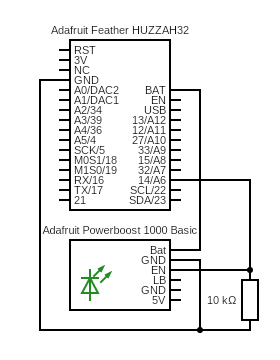

# powerboost

Turn on and off an Adafruit Powerboost using a Feather.

## Sketch

The sketch can be found [here][1].

## Hypothesis

The `EN` pin on the Powerboost when shorted to ground turns off the board.
A 10kΩ can connect the `EN` pind and `GND` to cause the Powerboost to be
off all of the time and the Feather can be used to drive the `EN` pin 
high, thus turing on the Powerboost.

## Assumptions

- It is fine to keep the resistor between the `EN` pin and `GND` all of the time.

## Procedure

### Circuit

[Adafruit Feather Huzzah32][3] with the `Bat` pin connected to the `Bat` pin of the
[Adafruit Powerboost 1000 Basic][4] and pin `14` of the Feather connected to the `EN`
pin of the Powerboost. All `GND`s are connected together and the a 10kΩ resistor
between the Powerboost `EN` pin and `GND`.



Circuit made with [Circuit Diagram][2].

### Code

```shell
task test:compile-upload NAME=powerboost
```

### Output

```shell
test: powerboost
1
0
1
0
1
0
1
0
```

Green `PWR` LED on the Powerboost blinks every second.

## Analysis

Overall, the Feather was able to turn the Powerboost on and off without any
issues.

## Conclusion

The Feather can be used turn the Powerboost on and off. A button connected to
the Feather may be used to turn the Powerboost on and off. One issue is that
the Powerboost can only be turned on if the Feather is also on. Sometimes when
the current draw is to high from the Powerboost will cause the Feather to turn
off which will cause everything to turn off. Perhaps a manual switch may be
placed between the resistor and ground that will completely float the `EN` pin
causing to Powerboost to be turned on manually.

## References
- https://forums.adafruit.com/viewtopic.php?f=8&t=163192&p=802434#p802434

[1]: https://github.com/nicholaswilde/solar-battery-charger/tree/main/test/powerboost
[2]: https://www.circuit-diagram.org/
[3]: https://www.adafruit.com/product/3405
[4]: https://www.adafruit.com/product/2030
