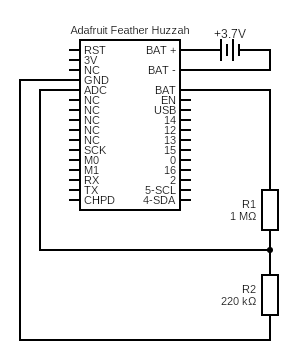

# thingspeak

Reads value on analog input A0 and calculates the the percent level of a
lipo battery and uploads the value to ThingSpeak.

## Sketch

The sketch can be found [here](https://github.com/nicholaswilde/solar-battery-charger/tree/main/test/thingspeak).

## Hypothesis

The Adafruit Feather Huzzah can be used to upload data to ThingSpeak.

## Assumptions

WIP

## Procedure

### Circuit



### Code

Create a channel on [ThingSpeak](https://www.mathworks.com/help/thingspeak/getting-started-with-thingspeak.html).

Enter ThingSpeak and WiFi credentials in `secrets.h`.

Change the ThingSpeak update interval by changing the `DELAY_LOOP` variable in the sketch.

Note: The update interval should not be less than 15 seconds (15000) for free accounts.
See the [ThingSpeak FAQ](https://thingspeak.com/pages/license_faq) for details.

Install the ThingSpeak library

```shell
arduino-cli lib install ThingSpeak
```

Compile and upload the code.

### Output

```shell
Battery level: 80%
Attempting to connect to SSID: MySSID
.......
       Connected.
Channel update successful.
Battery level: 80%
Channel update successful.
Battery level: 80%
Channel update successful.
...
```

The Feather should read the battery level, connect to WiFi, and upload the
battery level to ThingSpeak.

## Analysis

WIP

## Conclusion

WIP

## Troubleshooting

WIP

## References
- https://learn.adafruit.com/using-ifttt-with-adafruit-io/wiring#battery-tracking
- https://github.com/mathworks/thingspeak-arduino/blob/4110765fca328faf6abebcc8d7ed3a78ad583c2a/examples/ESP8266/program%20board%20directly/WriteSingleField/WriteSingleField.ino
