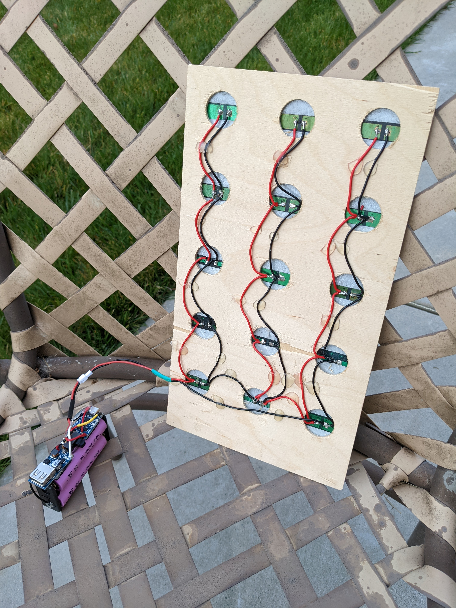
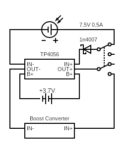

# v2

Charge the li-ion batteries using a solar panel and then charge USB
devices using the li-ion batteries.

<figure markdown>
  {width="480"}
</figure>

<figure markdown>
  {width="480"}
</figure>

## Sketch

The sketch can be found [here](https://github.com/nicholaswilde/solar-battery-charger/tree/main/test/v2).

## Hypothesis

The `TP4056` can be used to charge a `3.7V` li-ion battery and then the
battery can be used to charge other devices using the USB boost converter.

## Assumptions
- One `3.7V` li-ion is being used to capture the soloar energy.
- The DPDT switch disallows the li-ion battery from charging and the USB boost
converter being used at the same time.

## Procedure

### Circuit

Connect the solar panel to the `IN+` and `IN-` of the `TP4056`.

Connect one `NC` throw of the switch between the solar panel and `IN+` of the
`TP4056`.

Connect the other `NO` throw of the switch between the `IN+` of the boost
converter and `OUT+` of the `TP4056`.

Connect the `3V` li-ion batter to the `B+` and `B-` of the `TP4056`.

Connect the `JST-PH 2.0` connector between the solar panel and the `TP4056`.

Circuit made with [Circuit Diagram](https://www.circuit-diagram.org/)

### Output

The red LED on the `TP4056` is on when the li-ion battery is charging via the solar panel.

The blue LED on the `TP4056` is off when the li-ion battery is charging via the solar panel.

The red LED on the `TP4056` is on off the li-ion battery is fully charged and the solar panel is on.

The blue LED on the `TP4056` is on when the li-ion battery is fully charged and the solar panel is on.

The red LED on the boost converter is off when the solar panel is on.

The red LED on the boost converter is on when the solar panel is off.

## Analysis

WIP

## Conclusion

WIP

## Troubleshooting

WIP

## References

WIP
