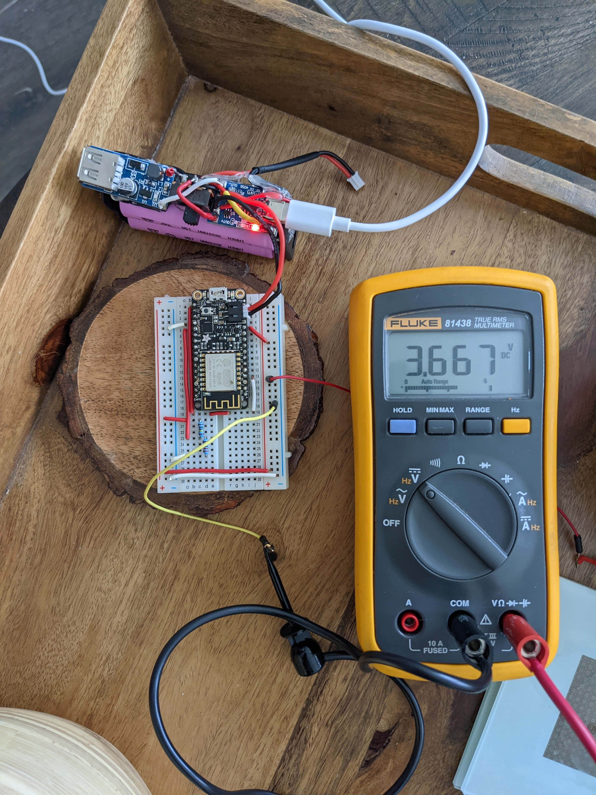
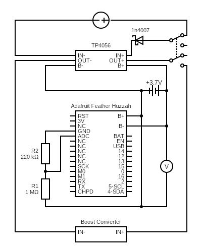
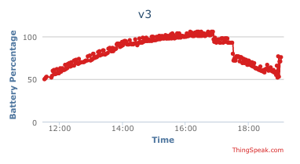
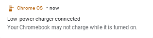

# v3

Monitor the charging battery level.

<figure markdown>
  {width="480"}
</figure>

## Sketch

The sketch can be found [here](https://github.com/nicholaswilde/solar-battery-charger/tree/main/test/v3).

## Hypothesis

The Adafruit Feather Huzzah can be used to monitor the level of 
the charging li-ion battery as it is being charged by the solar
panel.

## Assumptions
- The `3.7V` li-ion is being used to capture the soloar energy and power the Feather.
- The grounds of the TP4056 and Feather will not interfere with each other.
- The `VOLTAGE_MAX` variable is the actual maximum voltage that cuts off the charging
  of the `TP4056`.

## Procedure

The li-ion battery is charged using a USB C wall plug until the battery is charged
completely.

The USB C wall plug is then unplugged and the li-ion batteries are then plugged
into a Chromebook to charge the Chromebook battery first with the Chromebook in
sleep mode and then with the Chromebook being used while charging.

### Circuit

`v3` is based off of `v2` except for the following.

It is being powered by a USB wall adapter instead of the solar panel.

The Feather is being powered by the li-ion battery as well and reporting the battery levels.

Add a voltage divider with `R1=1MΩ` and `R2=220kΩ` and connect it to the positive side of the
charging li-ion battery and the connection point of the resistors to `ADC` on the Feather.

Connect the outer side of `R2` to the common ground.

Connect the `RST` pin to pin `16`.

Circuit made with [Circuit Diagram](https://www.circuit-diagram.org/)

### Code

Change the variables in the `secrets.h` file and the variables at the top of
the `v3.ino` sketch.

Compile and upload the sketch as normal.

### Output

## Analysis

The values go above `100%` which means that the maximum voltage of the charging
battery is set too low in the sketch. This might be because the Feather is also using
some power while charging.

The `TP4056` blue light never turned on which means the voltage never got high enough.
This contradicts the maximum voltage of being over 100% so something is not right.

The values spike up and down quite a bit at the end of the graph (~19:00). This is due
to the Chromebook being used at the same time as the charging. The Chromebook gave a
`low power charger connected` notification and automatically turned on and off the
charging.

The data is not very smooth. Perhaps averaging the read values a bit more would
smooth out the data.

## Conclusion

The large fluctuations at the end of the data (~19:00) is caused by the Chromebook
fluctuating its charging load automatically.

The cut off voltage was never reached to turn on the `TP4056` blue LED because the
Feather was also using power from the charger.

The data should be smoothed out a bit more using some other method.

## Troubleshooting

WIP

## References

WIP
