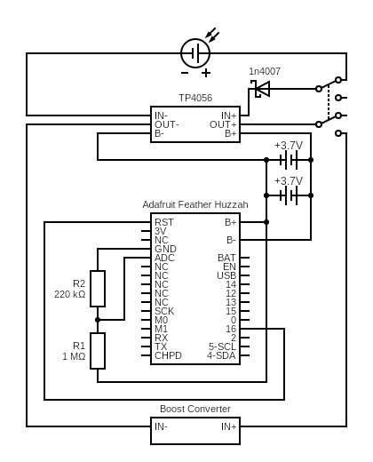

# v4

Reads value on analog input A0 and calculates
the the percent level of a lipo battery and
upload the value to ThingSpeak.

<figure markdown>
  {width="480"}
</figure>

<figure markdown>
  {width="480"}
</figure>

<figure markdown>
  {width="480"}
</figure>

## Sketch

The sketch can be found [here](https://github.com/nicholaswilde/solar-battery-charger/tree/main/test/v4).

## Hypothesis

WIP

## Assumptions

WIP

## Procedure

WIP

### Circuit



Circuit made with [Circuit Diagram](https://www.circuit-diagram.org/)

### Code

WIP

### Output

```shell title="Typical Output"
Connecting to SSID: MySSID
...connected
IP Address: 192.168.1.77
Hostname: Feather
Battery level: 745
Battery percentage: 90%
Battery voltage: 4.04V
Channel number: 1642208
Channel update successful
Going to sleep for 15 minutes
```


## Analysis

WIP

## Conclusion

WIP

## Troubleshooting

WIP

## References

WIP
