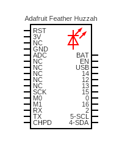

# wifi

A quick wifi test that pings a website.

## Sketch

The sketch can be found [here](https://github.com/nicholaswilde/solar-battery-charger/tree/main/test/wifi).

## Hypothesis

WIP

## Assumptions

WIP

## Procedure

WIP

### Circuit

Circuit made with [Circuit Diagram](https://www.circuit-diagram.org/)

### Code

WIP

### Output

WIP

## Analysis

WIP

## Conclusion

WIP

## Troubleshooting

WIP

## References

WIP
