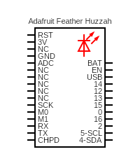

# blink

Blink the built in LED without a delay.

## Hypothesis

WIP

## Assumptions

WIP

## Procedure

WIP

### Circuit

Use the built in red LED.

Circuit made with [Circuit Diagram](https://www.circuit-diagram.org/)

### Code

WIP

### Output

WIP

## Analysis

WIP

## Conclusion

WIP

## Troubleshooting

WIP

## References
- https://www.arduino.cc/en/Tutorial/BuiltInExamples/BlinkWithoutDelay
