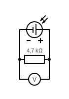

# cell

Measure the voltage and current of a single solar panel cell.

## Hypothesis

The output of a single solar cell is around 2V and 200 mA based on a similar
sized cell.

The solar cells were salvaged from some outdoor solar landscape lights that were replaced
by hardwired ones. The voltage and current of the cells were unknown and so this test is
meant to measure them. The cells are `57mm x 57mm` and [these ones on Amazon](https://www.amazon.com/dp/B087TK7T7T/)
are `50mm x 50mm` which is similar in size. The Amazon ones are `2V` and `160mA` and so I estimated that
the 57mm ones are around `2V` and `200 mA`.

## Assumptions
- The multimeter is accurate.
- Ohm's Law is valid.
- The resistor can handle the power dissipation.

## Procedure

### Circuit

Connect a 20Ω resistor to a solar cell.



Circuit made with [Circuit Diagram](https://www.circuit-diagram.org/)

### Output

Measure the actual resistance of the resistor.

Measure the voltage across the resistor when the cell is in direct sun light.

| Measurement | Value  |
| :---------- | ----:  |
| Resistance  | 20Ω    |
| Voltage     | 2.212V |

## Analysis

### Current

The current through the resistor can be calculated using [Ohm's law](https://en.wikipedia.org/wiki/Ohm%27s_law).

`I=V/R`

Using our measure values.

```
I=2.212V/20Ω
I=0.111A
```

### Power

The [power](https://en.wikipedia.org/wiki/Power_%28physics%29) through the resistor can be calculated using the following formula.

`P=IV`

Using our measure values.

```
P=0.111A*2.212V
P=0.25W
```

| Calculation | Value  |
| :---------- | ----:  |
| Current     | 0.111A |
| Power       | 0.25W  |

## Conclusion

WIP

## Troubleshooting

WIP

## References

WIP
