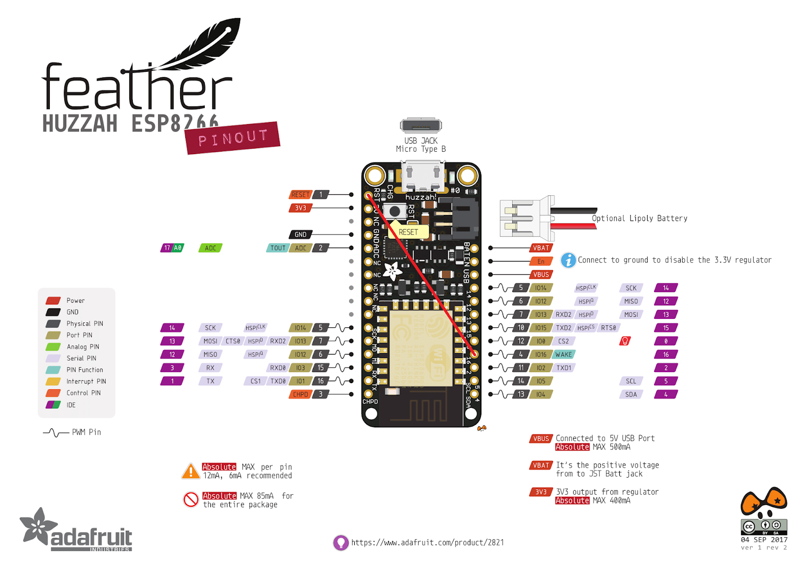

# sleep

Put the Adafruit Feather Huzzah to a deep sleep.

## Hypothesis

The Adafruit Feather Huzzah can be put to a deep sleep and wake up after a
specified amount of time.

## Assumptions

WIP

## Procedure

### Schematic

Connect the `RST` pin to pin `16`.



### Code

From the `./test/sleep` directory:
```
# compile
arduino-cli compile -b esp8266:esp8266:huzzah .
# upload
arduino-cli upload -p /dev/ttyUSB0 -b esp8266:esp8266:huzzah .
# monitor
screen /dev/ttyUSB0 115200
```

During the first bootup after the upload, the Feather might be stuck with the
internal light dim. Press the physical `RESET` button.

### Output

```
rll��|�l�|�l�b|����r�b�b��nn�lnn���bp��lrlrlp�n��l��bn�|���b��nn�l��l`�nn�lnr���nrr�`p�n�r������bn�|�b��nn��l`�nn�lnr���nrl`r��nrl`��pl`�n�lwaking up
going to sleep
rll��|�l�|�l�b|����r�b�b��nn�lnn���bp��lrlrlp�n��l��bn�|���b��nn�l��l`�nn�lnr���nrr�`p�n�r������bn�|�b��nn��l`�nn�lnr���nrl`r��nrl`��pl`�n�lwaking up
going to sleep
```
I don't know why there is garbage that is sent to to the serial monitor during
bootup of the Feather. The higher the baud rate, the longer the garbage.

## Analysis

During normal operation, the Feather should turn on the internal LED for the
time specified by `DELAY_LOOP`.

The Feather should then sleep for the amount of time specified by
`SLEEP_TIME` and the internal LED should turn off.

## Conclusion

WIP

## Troubleshooting

### The internal LED is dim and the console is blank when connected to a computer via USB

The Feather needs to be reset. Press the physical `RESET` button.
