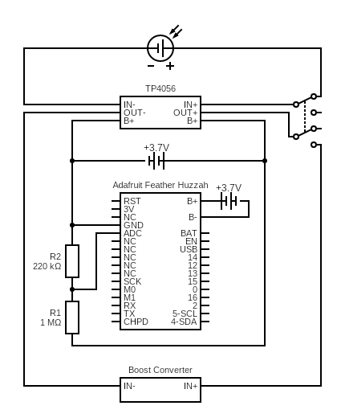

# v3

Monitor the charging battery level.

## Hypothesis

The Adafruit Feather Huzzah can be used to monitor the level of 
the charging li-ion battery as it is being charged by the solar
panel.

## Assumptions
- One lipo is being used to capture the soloar energy.
- One lipo is being used to power the Feather.
- The grounds of the TP4056 and Feather will not interfere with each other.

## Procedure

### Circuit

`v3` is based off of `v2`.

Connect the grounds of TP4056 and the Feather.

Add a voltage divider with `R1=1MΩ` and `R2=220kΩ` and connect it to the positive side of the
charging li-ion battery and the connection point of the resistors to `ADC` on the Feather.

Connect the outer side of `R2` to the common ground.

Circuit made with [Circuit Diagram](https://www.circuit-diagram.org/)

### Code

WIP

### Output

WIP

## Analysis

WIP

## Conclusion

WIP

## Troubleshooting

WIP

## References

WIP
