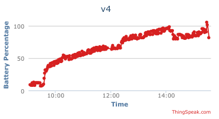

# v4

Reads value on analog input A0 and calculates
the the percent level of a lipo battery and
upload the value to ThingSpeak.

## Hypothesis

WIP

## Assumptions

WIP

## Procedure

WIP

### Circuit

Circuit made with [Circuit Diagram](https://www.circuit-diagram.org/)

### Code

WIP

### Output

## Analysis

WIP

## Conclusion

WIP

## Troubleshooting

WIP

## References

WIP
